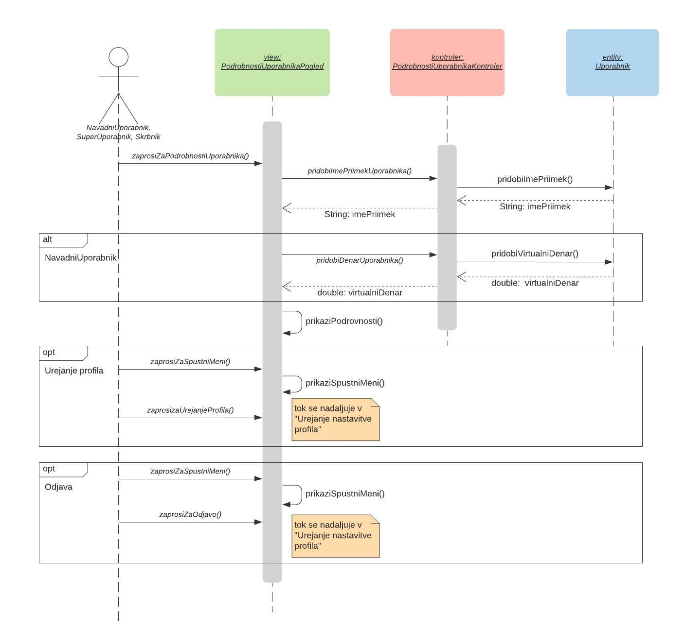

# Načrt sistema

| | |
|:---|:---|
| **Naziv projekta** | Stockbotics™ |
| **Člani projektne skupine** | Mark Bogataj, Melanija Kraljevska, Jer Pelhan, Nina Velikajne |
| **Kraj in datum** | Ljubljana, 6. 4. 2020 |

## Povzetek

Ta dokument predstavlja podroben načrt bodočega sistema, katerga zahteve so opisane v drugem delu lastnega projekta. 

Za načrta arhitekture smo uporabili vzorec MVC (Model-pogled-krmnilnik). Prikaz načrta arhitekture vsebuje 2 pogleda: logični pogled, ki je predstavljen s pomočjo blokovnega diagrama in razvojni pogled, ki je predstavljen z UML komponentnem diagramom.

Načrt strukture sistema je prikazan z razrednim diagramom, kjer so prikazane povezave med razredi. Opis posameznega razreda smo, zarad preglednosti, v diagramu spustili, saj so po diagramu opisani atributi in metode posameznega razreda. 

Kot osnovo za načrt obnašanja, smo upoštevali diagram primerov uporabe iz drugega lastnega projekta. To poglavje vsebuje diagrame zaporedja primerov uporabe, kjer so prikazani tokovi dogodkov znotraj primera.

Uporabili smo dva načrtovalska vzorca, in sicer načrtovalski vzorec [Template](https://refactoring.guru/design-patterns/template-method) in [Strategy](https://refactoring.guru/design-patterns/strategy), katerih uporaba za rešitev določenega problema je opisana pri opisu razredov.

## 1. Načrt arhitekture

### 1.1 Logični pogled

### 1.2 Razvojni pogled

## 2. Načrt strukture

### 2.1 Razredni diagram

Pri načrtovanju strukture smo uporabili dva načrtovalska vzorca. 
* [Template](https://refactoring.guru/design-patterns/template-method): razred Uporabnik je abstrakten in generalizira Skrbnika in Navadnega uporabnika, posledično SuperUporabnika.
* [Strategy](https://refactoring.guru/design-patterns/strategy): poenostavlja uporabo treh različnih strategij, ki jih ima na voljo bot po odločitvi.

### 2.2 Opis razredov

#### Ime razreda: NavadniUporabnik

Z razredom NavadniUporabnik predstavimo navadnega uporabnika. Uporablja načrtovalski vzorec [Template](https://refactoring.guru/design-patterns/template-method) in je genaraliziran v razred Uporabnik.

##### Atributi

| Ime atributa | Podatkovni tip(če ni očiten) | Zaloga vrednosti(če ni očitna) | Pomen (če ni očiten) |
| --- | --- | --- | --- |
| ocena | double | - | - |
| denar | double | - | - |
| uporabniskoIme | String | ^[a-zA-Z0-9]\*$ | - |
| geslo | String | ^(?=.\*[a-z])(?=.\*[A-Z])(?=.\*\d)(?=.\*[@$!%\*?&amp;])[A-Za-z\d@$!%\*?\&amp;]{8,}$ | - |
| email | String | /^[a-zA-Z0-9.!#$%&amp;&#39;\*+/=?^\_\`{/}~-]+@[a-zA-Z0-9-]+(?:\.[a-zA-Z0-9-]+)\*$/ | - |
| imePriimek | String | /^[a-zA-Z\s]\*$/ | - |
| seznamBotov | ArrayList\<TrgovalniBot\> | - | Seznam vseh botov, ki jih ima uporabnik v lasti |

* Opombe: seznamBotov lahko vsebuje največ tri elemente.

##### Nesamoumnevne metode

| Ime metode                | Imena in tipi parametrov | Tip rezultata | Pomen (če ni očiten)                                                                            |
|---------------------------|--------------------------|---------------|-------------------------------------------------------------------------------------------------|
| pridobiBoteUporabnika()   | \-                       | boolean       | Iz baze pridobi vse bote uporabnika. Metoda vrne true, če je pridobitev uspešna in false če ni. |
| izracunOcene()            | \-                       | int           | Izračun ocene uporabnika na podlagi ocen botov v lasti                                          |
| pristejDenar()            | Double denar             | boolean       | Metoda prišteje virtualni denar na račun uporabnika.                                            |
| odstejDenar()             | Double denar             | boolean       | Metoda odšteje virtualni denar na računu uporabnika.                                            |
| postaniSuperUporabnik()   | Int idUporabnika         | void          | NavadniUporabnikse nadgradi v SuperUporabnik.                                                   |
| dodajBota()               |    \-                    | void          | Sproži postopek kreiranja novega trgovalnega bota.                                              |
| posodobiZadnjoAktivnost() | Int idUporabnika         | void          | Uporabniku posodobi atribut zadnjaAktivnost - datum zadnje prijave.                             |

#### Ime razreda: SuperUporabnik

Z razredom SuperUporabnik predstavimo super uporabnika. Generaliziran je v razred NavadniUporabnik.

##### Atributi

Razred nima svojih atributov.

* Opombe: seznamBotov lahko vsebuje največ deset elementov.

##### Nesamoumnevne metode

Razred nima svojih metod.

####  Ime razreda: PrijavaPogled

Razred Prijava predstavlja mejni razred primera uporabe prijave gosta.

##### Atributi

| Ime atributa | Podatkovni tip(če ni očiten) | Zaloga vrednosti(če ni očitna) | Pomen (če ni očiten) |
| --- | --- | --- | --- |
| uporabniskoIme | String | ^[a-zA-Z0-9]\*$ | - |
| geslo | String | ^(?=.\*[a-z])(?=.\*[A-Z])(?=.\*\d)(?=.\*[@$!%\*?&amp;])[A-Za-z\d@$!%\*?&amp;]{8,}$ | - |

* Opomba uporabniška imena so unikatna. Uporabniška imena z besedo &quot;admin&quot; pa so rezervirana za skrbnike.

##### Nesamoumnevne metode

| Ime metode               | Imena in tipi parametrov | Tip rezultata | Pomen (če ni očiten)                                        |
|--------------------------|--------------------------|---------------|-------------------------------------------------------------|
| prikaziSporocilo()       | String sporocilo         | void          | Če je validacija vnešenih podatkov napačna, prikaže napako. |
| zaprosiZaPrijavo()       |      -                    |   void           |        -                                                     |
| potrdiPrijavo()          |        -                  |       void       |    -                                                         |
| preberiPodatke()         | -                        | void          | Prebere uporabniško ime in geslo z vnosnih polj.            |
| preusmeriNaDomacoStran() | -                        | void          |      -                                                       |

#### Ime razreda: PrijavaKontroler

Razred PrijavaKontroler predstavlja kontrolni razred primera uporabe prijave gosta.

##### Atributi

Razred nima atributov.

##### Nesamoumnevne metode
| Ime metode  | Imena in tipi parametrov            | Tip rezultata | Pomen (če ni očiten)                                 |
|-------------|-------------------------------------|---------------|------------------------------------------------------|
| validiraj() | String uporabniskoIme, String geslo | boolean       | -                                                    |
| prijavi()   | String uporabniskoIme, String geslo | void         | Posreduje podatke kontrolerju za prijavo uporabnika. |

#### RegistracijaPogled

Razred Registration predstavlja mejni razred primera uporabe registracije gosta.

##### Atributi

| Ime atributa | Podatkovni tip(če ni očiten) | Zaloga vrednosti(če ni očitna) | Pomen (če ni očiten) |
| --- | --- | --- | --- |
| uporabniskoIme | String | ^[a-zA-Z0-9]\*$ | - |
| geslo | String | ^(?=.\*[a-z])(?=.\*[A-Z])(?=.\*\d)(?=.\*[@$!%\*?&amp;])[A-Za-z\d@$!%\*?&amp;]{8,}$ | - |
| email | String | /^[a-zA-Z0-9.!#$%&amp;&#39;\*+/=?^\_\`{/}~-]+@[a-zA-Z0-9-]+(?:\.[a-zA-Z0-9-]+)\*$/ | - |
| imePriimek | String | /^[a-zA-Z\s]\*$/ |-|
 

##### Nesamoumnevne metode

| Ime metode | Imena in tipi parametrov | Tip rezultata | Pomen (če ni očiten) |
| --- | --- | --- | --- |
| prikaziSporocilo() | String sporocilo | void | - |
| preberiPodatke() | - | void | Prebere uporabniško ime, geslo, email in ime in priimek z vnosnih polj. |-|
| zaprosiZaRegistracijo() | - | void |-|
| potrdiRegistracijo() | String imePriimek, uporabniško ime, email, geslo | void |-|
 
 
#### Ime razreda: Ime razreda: KnjiznicaPogled

Razred KnjiznicaPogled predstavlja mejni razred primera uporabe privatne knjižnice uporabnika.

##### Atributi

Razred nima atributov.

##### Nesamoumnevne metode

| Ime metode                    | Imena in tipi parametrov | Tip rezultata           | Pomen (če ni očiten)                                               |
|-------------------------------|--------------------------|-------------------------|--------------------------------------------------------------------|
| prikaziSporocilo()            | String sporocilo         | void                    | -                                                                  |
| preberiCeno()                 | -                        | int                     | Prebere ceno trgovalnega bota z vnosnega polja.                    |
| prikaziTrgovalneBote()        | ArrayList\<TrgovalniBot\>  | void                    | Prikaže vse trgovalne bote v lasti uporabnika.                     |
| pridobiSeznamBotov()          |       -                   | ArrayList\<TrgovalniBot\> |    -                                                                |
| zaprosiZaObjavo()             | -                        | TrgovalniBot bot        | Zabeleži in posreduje bota, katerega se želi objaviti v trgovini.  |
| zaprosiZaUrejanjeParametrov() | -                        | TrgovalniBot bot        | Zabeleži in posreduje bota, kateremu se želi spremeniti parametre. |
| zaprosiZaPodrobnostiBota()      | -                        | TrgovalniBot bot        | Zabeleži in posreduje bota, katerega podrobnosti se želi videti.   |
| posodobiGumb()                | boolean                  | void                    | Če je true mora biti gumb “Zaženi”, in če false je “Ustavi”.       |
| zaprosiZaIzbrisBota()         | -                        | void                    | Zabeleži in posreduje bota, katerega se želi izbrisati.            |
| potrdiIzbrisBota()            | -                        | void                    | Prične s postopkom brisanja trgovalnega bota.                      |
| prikaziSporocilo()            | -                        | void                    | -                                                                  |
| objaviBota()                  | Int IdBota               | Boolean objavljen       | Vrne true, če se je bot uspešno objavil v trgovini                 |
| potrdiObjavo()                | -                        | void                    |    -                                                                |
 
#### Ime razreda: KnjiznicaKontroler

Razred KnjiznicaKontroler predstavlja kontrolni razred primera uporabe za privatno knjižnico uporabnika.

##### Atributi

| Ime atributa | Podatkovni tip(če ni očiten) | Zaloga vrednosti(če ni očitna) | Pomen (če ni očiten) |
| --- | --- | --- | --- |
| seznamBotov | ArrayList\<TrgovalniBot\> | - | - |

##### Nesamoumnevne metode

| Ime metode | Imena in tipi parametrov | Tip rezultata | Pomen (če ni očiten) |
| --- | --- | --- | --- |
| pridobiBoteUporabnika() | Int idUporabnika | ArrayList\<TrgovalniBot\> | - |
| ustaviBota() | TrgovalniBot bot | - | Posreduje klic v razred UstaviBotaKontroler. |
| zazeniBota() | TrgovalniBot bot | - | Posreduje klic v razred UstaviBotaKontroler. |
| urediParametre() | TrgovalniBot bot | void | Posreduje klic za urejanje parametrov v ParametriKontroler. |
| pridobiTrgovalniBot() | Integer idBota | TrgovalniBot | Iz seznama botov vrne TrgovalniBot z idBota |
| izbrisiTrgovalniBot() | TrgovalniBot bot | boolean | Posreduje klic brisanja bota v BrisanjeBotaKontroler. |
| podrobnostiBota() | Integer idBota | void | Posreduje klic v PodrobnostiBota |
| prikaziTrgovalneBote() | ArrayList\<TrgovalniBot\> | void | - |
| objaviBota() | TrgovalniBot bot | Boolean objavljen | - |
 
#### Ime razreda: TimerKontroler

Razred TimerKontrole predstavlja kontrolni razred, ki skrbi, da se trgovanje bota izvede enkrat na dan.

##### Atributi

Nima atributov.

##### Nesamoumnevne metode

| Ime metode | Imena in tipi parametrov | Tip rezultata | Pomen (če ni očiten) |
| --- | --- | --- | --- |
| preveriCas() | - | boolean | Vrne true, če je od zadnje aktivacije botov preteklo 24 ur. |

#### Ime razreda: Kontekst

Razred predstavlja kontrolni razred za izvedbo in nastavitev pravilne strategije. Predstavlja del načrtovalskega vzorca [Strategy](https://refactoring.guru/design-patterns/strategy).

##### Atributi
Nima atributov.

##### Nesamoumnevne metode

| Ime metode | Imena in tipi parametrov | Tip rezultata | Pomen (če ni očiten) |
| --- | --- | --- | --- |
| nastaviStrategijo() | Strategija strategija | - | Nastavi strategijo - kupi, pordaj, ohrani. |
| izvediStrategijo() | TrgovalniBot bot, Podjetje podjetje | boolean | Izvede nastavljeno strategijo. |

#### Ime razreda: BrisanjeBotaKontroler
Razred BrisanjeBotaKontroler predstavlja kontrolni razred primera uporabe za brisanje bota uporabnika.

##### Atributi
Razred nima atributov.

##### Nesamoumnevne metode
| Ime metode    | Imena in tipi parametrov | Tip rezultata | Pomen (če ni očiten)                                                                                    |
|---------------|--------------------------|---------------|---------------------------------------------------------------------------------------------------------|
| izbrisiBota() | TrgovalniBot bot         | boolean       | Vrne true, če je bil bot uspešno izbrisan in false, če ni bil. Bot se izbriše iz knjižnice in trgovine. |

#### Ime razreda: ObjavaBotaKontroler
Razred ObjavaBotaKontroler predstavlja kontrolni razred primera uporabe objave bota za prodajo v trgovini.

##### Atributi
Razred nima atributov.

##### Nesamoumnevne metode
| Ime metode   | Imena in tipi parametrov | Tip rezultata | Pomen (če ni očiten)                            |
|--------------|--------------------------|---------------|-------------------------------------------------|
| objaviBota() | TrgovalniBot bot         | void          | Super uporabnik svojega bota objavi v trgovini. |

#### Ime razreda: RegistracijaKontroler

Razred RegistracijaKontroler predstavlja kontrolni razred, ki nadzira
registracijo uporabnika.

##### Atributi
V razredu ne hranimo nobenih atributov.

##### Nesamoumevne metode
| Ime metode                   | Imena in tipi parametrov                                              | Tip rezultata              | Pomen (če ni očiten)                                                     |
|------------------------------|-----------------------------------------------------------------------|----------------------------|--------------------------------------------------------------------------|
| preveriPodatke()             | String uporabnisko ime, String geslo, String email, String imePriimek | Boolean                    | Preveri pravilnost podatkov in enoličnost uporabniškega imena in emaila. |
| registriraj()                | \-                                                                    | void                       | Poskus registracije uporabnika.                                          |
| ustvariNavadnegaUporabnika() | String ime, priimek, geslo, email, euporabniško ime                   | NavadniUporabnik uporabnik |                   \-                                                     |

#### Ime razreda: UrejanjeProfilaKontroler
Razred UrejanjeProfilaKontroler predstavlja kontrolni razred primera uporabe
urejanja profila.

##### Atributi
V razredu ne hranimo nobenih atributov. 

##### Nesamoumnevne metode
| Ime metode              | Imena in tipi parametrov                               | Tip rezultata | Pomen (če ni očiten)                                               |
|-------------------------|--------------------------------------------------------|---------------|--------------------------------------------------------------------|
| pridobiPodatkeUporabnika()      | int idUporabnika                                                   | void          | \-                                                                 |
| validiraj()             | String uporabniskoIme, String ImePriimek, String geslo | Boolean       | Preveri validnost vnešenih podatkov |
| nastaviPodatke()        | String uporabniskoIme, String ImePriimek, String geslo | void          | Posodobi podatke uporabnika v bazi .                                 |

 
#### Ime razreda: UrejanjeProfilaPogled

Razred UrejanjeProfila predstavlja mejni  razred primera uporabe urejanje profila.

##### Atributi
| Ime atributa | Podatkovni tip(če ni očiten) | Zaloga vrednosti(če ni očitna)                                                     | Pomen (če ni očiten) |
|--------------|------------------------------|------------------------------------------------------------------------------------|----------------------|
| email        | String                       | /\^[a-zA-Z0-9.!\#\$%&’\*+/=?\^_\`{\|}\~-]+\@[a-zA-Z0-9-]+(?:\\.[a-zA-Z0-9-]+)\*\$/ | \-                   |
| imePriimek   | String                       | /\^[a-zA-Z\\s]\*\$/                                                                | \-                   |
| geslo        | String                       | \^(?=.\*[a-z])(?=.\*[A-Z])(?=.\*\\d)(?=.\*[\@\$!%\*?&])[A-Za-z\\d\@\$!%\*?&]{8,}\$ | \-                   |

 

##### Nesamoumnevne metode
| Ime metode                 | Imena in tipi parametrov                               | Tip rezultata | Pomen (če ni očiten)                                                                           |
|----------------------------|--------------------------------------------------------|---------------|------------------------------------------------------------------------------------------------|
| potrdiSpremembo() | \-                                                     | String uporabniskoIme, String geslo          | Ob potrditvi prebere uporabniško ime in geslo iz vnosnih polj.                                  |                                |
| prikaziPoljaSPodatki()     |                                                        | void          | Prikaze vnosna polja ki vsebujejo podatke uporabnika, ki jih uporabnik lahko po želi spremeni. |
| prikaziSporocilo()         | String sporocilo                                       | void          | \-  |                 

 

#### Ime razreda: Skrbnik

Z razredom Skrbnik predstavimo uporabniško vlogo skrbnika. Razred Skrbnik
razširja razred Uporabnik.

##### Atributi
| Ime atributa   | Podatkovni tip(če ni očiten) | Zaloga vrednosti(če ni očitna)                                                     | Pomen (če ni očiten) |
|----------------|------------------------------|------------------------------------------------------------------------------------|----------------------|
| email          | String                       | /\^[a-zA-Z0-9.!\#\$%&’\*+/=?\^_\`{\|}\~-]+\@[a-zA-Z0-9-]+(?:\\.[a-zA-Z0-9-]+)\*\$/ | \-                   |
| imePriimek     | String                       | /\^[a-zA-Z\\s]\*\$/                                                                | \-                   |
| uporabniskoIme | String                       | \^[a-zA-Z0-9]\*\$                                                                  | \-                   |
| geslo          | String                       | \^(?=.\*[a-z])(?=.\*[A-Z])(?=.\*\\d)(?=.\*[\@\$!%\*?&])[A-Za-z\\d\@\$!%\*?&]{8,}\$ | \-                   |

 

##### Nesamoumnevne metode
Razred nima svojih metod.

 

#### Ime razreda: Gost

Z razredom Gost predstavimo uporabniško vlogo gosta oziroma neprijavljenega
uporabnika.

##### Atribut
Razred nima atributov.

##### Nesamoumnevne metode
Razred nima svojih metod.

#### Ime razreda: LestvicaPogled

Razred Lestvica je mejni razred primera uporabe prikaz lestvice uporabnikov.

#####  Atributi
Razred nima atributov

##### Nesamoumnevne metodev
| Ime metode                    | Imena in tipi parametrov          | Tip rezultata                         | Pomen (če ni očiten)                    |
|-------------------------------|-----------------------------------|---------------------------------------|-----------------------------------------|
| prikaziSortiraneUporabnike () | ArrayList\<Uporabnik\> uporabniki | void                                  | Prikaže sortirano lestvico uporabnikov. |
| pridobiLestvico()             | \-                                | ArrayList\<Uporabnik\> sortiranSeznam |               \-                        |
| prikaziLestvico()             | \-                                | void                                  | \-                                      |

 

#### Ime razreda: LestvicaKontroler

Razred lestvica kontroler predstavlja kontrolni razred primera uporabe prikaz
lestvice uporabnikov

##### Atributi

| Ime atributa | Podatkovni tip(če ni očiten)  | Zaloga vrednosti(če ni očitna) | Pomen (če ni očiten) |
|--------------|-------------------------------|--------------------------------|----------------------|
| uporabniki   | ArrayList\<NavadniUporabnik\> | \-                             | \-                   |

##### Nesamoumnevne metode

| Ime metode                     | Imena in tipi parametrov  | Tip rezultata                  | Pomen (če ni očiten)                                                 |
|--------------------------------|---------------------------|--------------------------------|----------------------------------------------------------------------|
| PridobiUporabnike()            | \-                        | ArrayList\<NavadniUporabnik\>  | Z baze pridobi vse upoorabnike.                                      |
| sortirajUporabnike()           | \-                        | void                           | Sortira uporabnike glede na njihovo oceno.                           |
| pridobiSeznamBotovUporabnika() | Int idUporabnika          | ArrayList\<TrgovalniBot\>      |        \-                                                            |
| pridobiLestvico()              | \-                        | ArrayList\<NavadniUporabnik\>  | \-                                                                    |
| pridobiTrgovalnegaBota()       | Int idBota                | TrgovalniBot                   |\-                                                                    |
| izracunajOceno()               | ArrayList\<TrgovalniBot\> | Double                         | Izračuna oceno uporabnika, glede na ocene njegovih trgovalnih botov. |

#### Ime razreda: Napoved
Razred Napoved je entitetni razred, s katerim predstavimo napoved.

##### Atributi
| Ime atributa | Podatkovni tip(če ni očiten)  | Zaloga vrednosti(če ni očitna) | Pomen (če ni očiten) |
|--------------|-------------------------------|--------------------------------|----------------------|
| high         | double                        | \-                             | Koeficient naraščanja|
| low          | double                        | \-                             | Koeficient padanja   |

##### Nesamoumevne metode
Ta razred nima nesamoumnevneih metod.

#### Ime razreda: TrgovanjeBotaKontroler
Razred TrgovanjeBotaKontroler je kontrolni razred trgovanja trgovalnega bota.

##### Atributi
Ta razred nima atributov.

##### Nesamoumevne metode
| Ime metode          | Imena in tipi parametrov            | Tip rezultata           | Pomen (če ni očiten)                                                                           |
|---------------------|-------------------------------------|-------------------------|------------------------------------------------------------------------------------------------|
| odlociSe()          | Napoved napoved, Boolean kupljen    | String(buy, sell, hold) | Ta metoda se na podlagi dobljene napovedi in lastništva delnice odloči, ali bo delnico prodal ali kupil ali počakal. |
| aktivirajBote()     | TrgovalniBot bot                    | void  | Začni odločanje trgovalnega bota |

#### Ime razreda: ZazeniBotaKontroler
Razred ZazeniBotaKontroler je kontrolni razred za zagon trgovalnega bota.

##### Atributi
Ta razred nima atributov.

##### Nesamoumevne metode
| Ime metode          | Imena in tipi parametrov            | Tip rezultata           | Pomen (če ni očiten)                                                                           |
|---------------------|-------------------------------------|-------------------------|------------------------------------------------------------------------------------------------|
| zazeniSe()          | TrgovalniBot bot                    | void                    | Ta metoda zažene trgovalnega bota, če še ni zagnan.                                            |

#### Ime razreda: UstaviBotaKontroler
Razred UstaviBotaKontroler je kontrolni razred za ustavitev trgovalnega bota.

##### Atributi
Ta razred nima atributov.

##### Nesamoumevne metode
| Ime metode          | Imena in tipi parametrov            | Tip rezultata           | Pomen (če ni očiten)                                                                           |
|---------------------|-------------------------------------|-------------------------|------------------------------------------------------------------------------------------------|
| ustaviSe()          | TrgovalniBot bot                    | void                    | Ta metoda ustavi trgovalnega bota, če je zagnan.                                            |

#### Ime razreda: PodrobnostiUporabnikaPogled
Razred PodrobnostiUporabnika predstavlja mejni razred uporabniških podrobnosti.

##### Atributi
Ta razred nima atributov.

##### Nesamoumevne metode
| Ime metode                 | Imena in tipi parametrov | Tip rezultata | Pomen (če ni očiten)                          |
|----------------------------|--------------------------|---------------|-----------------------------------------------|
| prikaziSpustniMeni()       | \-                        | void          | \-                                             |
| pridobiImePriimek()        | \-                        | String        | \-                                             |
| pridobiVirtualniDenar()    | \-                        | double        | \-                                             |
| prikaziPodrobnosti()       | \-                        | void          | \-                                             |
| zaprosiZaOdjavo()          | \-                        | void          | \-                                             |
| zaprosiZaUrejanjeProfila() | \-                        | void          | Preusmeri te na novo okno "Urejanje profila". |
| preusmeriNaPrijavo()       | \-                        | void          | Preusmeri na prijavno stran.

#### Ime razreda: VsiUporabnikiPogled
Razred VsiUporabniki predstavlja mejni razred pri prikazu strani vsi uporabniki.

##### Atributi
Ta razred nima atributov.

##### Nesamoumevne metode
| Ime metode                         | Imena in tipi parametrov | Tip rezultata | Pomen (če ni očiten)                    |
|------------------------------------|--------------------------|---------------|-----------------------------------------|
| prikaziSeznamUporabnikov()         | \-                        | void          | \-                                       |
| prikaziZadnjoAktivnostUporabnika() | \-                        | void          | \-                                       |
| zaprosiZaIzbrisUporabnika()        | \-                        | Integer       | Vrne ID izbranega uporabnika za izbris. |
| prikaziSporocilo()                 | \-                        | void          | \-                                       |
| pridobiSeznamUporabnikov()         | \-                        | ArrayList\<NavadniUporabnik\> | \-                       |
| pridobiZadnjoAktivnost()           | Uporabnik                | Int           | Vrne število dni od zadnje prijave v sistem. |
| izbrišiUporabnika()                | Int idUporabnika         | Boolean       | \-                                       |
| zaprosiZaPrikazVsehUporabnikov()   | \-                       | void          | \-                                       |

#### Ime razreda: VsiUporabnikiKontroler
Razred VsiUporabnikiKontroler predstavlja kontrolni razred pri strani vsi uporabniki.

##### Atributi
| Ime atributa           | Podatkovni tip                | Zaloga vrednosti | Pomen (če ni očiten)                                                                                                                        |
|------------------------|-------------------------------|------------------|---------------------------------------------------------------------------------------------------------------------------------------------|
| uporabniki             | ArrayList\<NavadniUporabnik\> | -                | -                                                                                                                                           |

##### Nesamoumevne metode
| Ime metode                 | Imena in tipi parametrov | Tip rezultata | Pomen (če ni očiten)                      |
|----------------------------|--------------------------|---------------|-------------------------------------------|
| pridobiSeznamUporabnikov() | \-                       | void          | \-                                         |
| izbrisiUporabnika()        | Int idUporabnika         | Boolean       | \-                                         |
| izracunajCasNeaktivnosti() | Uporabnik uporabnik      | Int           | Vrne število dni neaktivnosti uporabnika. |
| izbrisiBoteUporabnika()    | Uporabnik uporabnik      | Boolean       | \-                                         |

#### Ime razreda: TrgovinaKontroler
Razred TrgovinaKontroler predstavlja kontrolni razred trgovine.

##### Atributi
Ta razred nima atributov.

##### Nesamoumevne metode
| Ime metode               | Imena in tipi parametrov | Tip rezultata | Pomen (če ni očiten)                                |
|--------------------------|--------------------------|---------------|-----------------------------------------------------|
| pridobiBoteZaProdajo()   | \-                       | ArrayList\<TrgovalniBot\> | \-                                      |
| podrobnostiBota()        | \-                       | void          | \-                                                  |
| kupiBota()               | \-                       | Boolean       | Metoda posreduje klic v NakupBotaKontroler. Vrača boolean - uspešen nakup. |

#### Ime razreda: NakupBotaKontroler
Razred NakupBotaKontroler predstavlja kontrolni razred za nakup trgovalnega bota.

##### Atributi
Ta razred nima atributov.

##### Nesamoumevne metode
| Ime metode               | Imena in tipi parametrov | Tip rezultata | Pomen (če ni očiten)                                |
|--------------------------|--------------------------|---------------|-----------------------------------------------------|
| kupiBota()               | TrgovalniBot bot         | Boolean       | Vrne true, če je bot uspešno kupljen.               |
| preveriStanjeDenarja     | Double stanje, Double cena | Boolean     | Preveri, če ima uporabnik dovolj denarja za nakup trgovalnega bota. |
| preveriOmejitev()        | ArrayList\<TrgovalniBot\> | Boolean      | Metoda preveri, če uporabnik ne preseže omejitve glede števila botov, ki jih ima lahko v lasti. (NavadniUporabnik 3, SuperUporabnik 10) |

#### Ime razreda: TrgovinaPogled
Razred Trgovina predstavlja mejni razred pri prikazu trgovine.

##### Atributi
Ta razred nima atributov.

##### Nesamoumevne metode
| Ime metode             | Imena in tipi parametrov | Tip rezultata | Pomen (če ni očiten) |
|------------------------|--------------------------|---------------|----------------------|
| zaprosiZaNakupBota()   | \-                       | void          | \-                   |
| prikaziTrgovalneBote() | ArrayList\<TrgovalniBot\> boti | vodi    | \-                   |
| zaprosiZaPodrobnosti() | Int idBota               | Int           | Vrne ID izbranega bota. |

#### Ime razreda: TrgovalniBot
Razred TrgovalniBot predstavlja entitetni razred trgovalnega bota.

##### Atributi
| Ime atributa           | Podatkovni tip | Zaloga vrednosti | Pomen (če ni očiten)                                                                                                                        |
|------------------------|----------------|------------------|---------------------------------------------------------------------------------------------------------------------------------------------|
| ime                    | String         | -                | -                                                                                                                                           |
| opis                   | String         | -                | -                                                                                                                                           |
| kreator                | String         | -                | Uporabniško ime uporabnika, ki je naredil bota.                                                                                             |
| cena                   | double         | -                | -                                                                                                                                           |
| parameterStevilaDelnic | Integer        | -                | Maksimalno število delnic, v katere lahko trovalni bot investira.                                                                           |
| parameterInvesticije   | double         | -                | Količina virtualnega denarja, namenjen trgovalnemu botu za trgovanje.                                                                       |
| parameterNakupa        | double         | -                | V kolikor je na podlagi napovedi izračunan koeficient spreminjanja vrednosti delnice večji od tega parametra, trgovalni bot delnice kupi.   |
| parameterProdaje       | double         | -                | V kolikor je na podlagi napovedi izračunan koeficient spreminjanja vrednosti delnice manjši od tega parametra, trgovalni bot delnice proda. |
| zagnan                 | Boolean        | -                | Če ima vrednost na true potem je bot zagnan, če je na false ni zagnan.                                                                      |
| dobickonosnost         | double         | -                | Vrednost, ki predstavlja razmerje med količino pridobljenega in izgubljenega denarja.                                                       |
| pridobljeniDenar       | double         | -                | Količina denarja, ki ga je bot pridobil pri trgovanju.                                                                                      |
| izgubljeniDenar        | double         | -                | Količina denarja, ki ga je bot izgubil pri trgovanju.                                                                                       |
| naprodaj               | Boolean        | -                | Paramtere, ki ima vrednost true, če se bot prodaja v trgovini.                                                                              |
| seznamPodjetij         | ArrayList\<Podjetje\> | -                | Seznam podjetij s katerimi bot trguje. |

* Opomba: cena trgovalnega bota je nastavljena na privzeto vrednost 0€.

##### Nesamoumevne metode
| Ime metode              | Imena in tipi parametrov                                                                                                        | Tip rezultata           | Pomen (če ni očiten)                                                                                              |
|-------------------------|---------------------------------------------------------------------------------------------------------------------------------|-------------------------|-------------------------------------------------------------------------------------------------------------------|
| pridobiBoteZaProdajo()  | -                                                                                                                               | ArrayList\<TrgovalniBot\> | Pridobi vse trgovalne bote, ki imajo boolean spremenljivko naprodaj nastavljen na true.                           |
| pridobiVseZagnaneBote() | -                                                                                                                               | ArrayList\<TrgovalniBot\> | Pridobi vse trgovalne bote, ki imajo boolean spremenljivko zagnan nastavljen na true.                             |
| prodajVseDelnice()      | -                                                                                                                               | void                    | Proda vse delnice v lasti.                                                                                        |
| klonirajTrgovalniBot()  | TrgovalniBot bot, Integer idKupca                                                                                               | TrgovalniBot            | Ustvari novo instanco bota, z istimi parametri, opisom in imenom, ter ga vrne, id lastnika pa nastavi na idKupca. |
| izbrisiBota()           | TrgovalniBot bot                                                                                                                | Boolean                 | Iz baze izbriše trgovalnega bota bot.                                                                             |
| izracunajDobicek()      | -                                                                                                                               | Double                  | Vrne razliko med pridobljeniDenar, izgubljeniDenar. Pri tem upošteva tudi parameter investicije.                  |
| nastaviParametre()      | Int parameterSteviloDelnic, double parameterInvesticije, int parameterNapovedi, double parameterProdaje, double parameterNakupa | void                    | Trgovalnemu botu posodobi vse parametre v bazi.                                                                   |

#### Ime razreda: ZgodovinskiPodatek 
Razred ZgodovinskiPodatek predstavlja entitetni razred, ki opisuje delniške podatke za posamezno podjetje na določen datum.

##### Atributi

| Ime atributa   | Podatkovni tip(če ni očiten) | Zaloga vrednosti(če ni očitna)                                       | Pomen (če ni očiten) |
|----------------|------------------------------|----------------------------------------------------------------------|----------------------|
| datum | String      | -               | -                  |
| open  | double      | -               | Vrednost po kateri vrednostni papir najprej trguje, ko se za ta dan odpre menjava                   |
| high  | double      | -               |   Koeficient naraščanja   |
| low  | double      | -               |   Koeficient padanja       |
| close  | double      | -               |   Končna vrednost, po kateri se trguje z vrednostnim papirjem na določen trgovalni dan           |
| volume  | double      | -               |  Število delnic, s katerimi se trguje v določenem časovnem obdobju                 |
| adjusted  | double      | -               |   Vrednost, ki natančno odraža vrednost te delnice po obračunu za kakršnekoli akcije podjetja.                |

* Opomba: Atribut datum je v obliki LLLL-MM-DD

##### Nesamoumnevne metode

Nesamoumnevne metode ni.

#### Ime razreda: Podjetje 
Razred Podjetje je entitetni razred, ki opisuje podjetje ki trguje na borzi

##### Atributi

| Ime atributa   | Podatkovni tip(če ni očiten) | Zaloga vrednosti(če ni očitna)                                       | Pomen (če ni očiten) |
|----------------|------------------------------|----------------------------------------------------------------------|----------------------|
| ime | String      | -  | -  |
| simbol | String      | -  | Kratica imena podjetja  |
| sektor | String      | -  | -  |
| valuta | String      | -  | -  |
| ZgodovinaDelnic | ArrayList\<ZgodovinskiPodatek\>  | -  | -  |

##### Nesamoumnevne metode

| Ime metode         | Imena in tipi parametrov | Tip rezultata | Pomen (če ni očiten)                                                    |
|--------------------|--------------------------|---------------|-------------------------------------------------------------------------|
| pridobiZgodovinskePodatkeApi() | String simbol, Date zacetniDatum, Date koncniDatum        | void          | Pridobije zgodovinske podatke podjetja prek zunanjega vmesnika in nastavi atributa zgodovinaDelnic.     |

#### Ime razreda: DomacaStranKontroler 
Razred DomacaStranKontroler je kontrolni razred primera uporabe prikaz delnic na domači stran.

##### Atributi

| Ime atributa   | Podatkovni tip(če ni očiten) | Zaloga vrednosti(če ni očitna)                                       | Pomen (če ni očiten) |
|----------------|------------------------------|----------------------------------------------------------------------|----------------------|
| seznamPodjetij | ArrayList\<Podjetje\>     | -  | -  |

##### Nesamoumnevne metode

| Ime metode         | Imena in tipi parametrov | Tip rezultata | Pomen (če ni očiten)                                                    |
|--------------------|--------------------------|---------------|-------------------------------------------------------------------------|
| preveriMoznostNadgradnje() | -       | boolean     |  Preveri ali navadni uporabnik izpolnjuje pogoje nagradnje v super uporabnika.  |
| zaprosiZaNadgradnjo() | -       | void     |  Začne proces dodajanja pravice navadnemu uporabniku za super uporabnika.   |
| pridobiPodjetjaNaBorzi() | -       | ArrayList\<Podjetje\> seznamPodjetij     |  V razrednemu atributu seznamPodjetij shrani vsa podjetja pridobljena iz sistema za pridobitev ameriških podjetij na borzi.    |
| zapriMoznostNadgradnje() | - | void | - |
   
#### Ime razreda: PodrobnostiUporabnikaKontroler 
Razred PodrobnostiUporabnikaKontroler je kontrolni razred primerov uporabe prikaz podrobnosti uporabnika.

##### Atributi

| Ime atributa   | Podatkovni tip(če ni očiten) | Zaloga vrednosti(če ni očitna)                                       | Pomen (če ni očiten) |
|----------------|------------------------------|----------------------------------------------------------------------|----------------------|
| ImePriimek | String     | -  | -  |
| virtualniDenar | double     | -  | -  |

##### Nesamoumnevne metode

| Ime metode         | Imena in tipi parametrov | Tip rezultata | Pomen (če ni očiten)                                                    |
|--------------------|--------------------------|---------------|-------------------------------------------------------------------------|
| pridobiImePriimekUporabnika() | int idUporabnika       | String    |  -   |
| pridobiDenarUporabnika() | int idUporabnika | double | - | 
| zaprosiZaUrejanje() | - | void | Posreduje klic za urejanje profila v PodrobnostiUporabnikaKontroler |
| zaprosiZaOdjavo() | - | void | Posreduje klic za odjavo v PodrobnostiUporabnikaKontroler |

#### Ime razreda: DomacaStranPogled
Razred DomacaStranPogled je mejni razred primerov uporabe prikaz delnic na domači strani.

##### Atributi

Razred nima svojih atributov.

##### Nesamoumnevne metode

| Ime metode         | Imena in tipi parametrov | Tip rezultata | Pomen (če ni očiten)                                                    |
|--------------------|--------------------------|---------------|-------------------------------------------------------------------------|
| prikaziDomacoStran() | - | void | - |
| prikaziPodjetja() | -       | void     |   -  |
| prikaziMoznostNadgradnje() | -       | void     |  Prikaže možnost nadgradnje uporabnika v super uporabnika,ob izpolnitvi pogojev. |
| sprejmiNadgradnjo() | -       | void     |  Če navadni uporabnik potrdi možnosti nagradnje, ga nadgradi v super uporabnik.    |
| zavrniNadgradnjo() | -       | void     |    Če navadni uporabnik prekliče nagradnjo, ohrani status navadnega uporabnika.  |
| zapriMoznostNadgradnje() | - | void | - |

#### Ime razreda: OdjavaKontroler
Razred OdjavaKotroler je kontrolni razred primera uporabe odjava uporabnika.

##### Atributi

Razred nima svojih atributov.

##### Nesamoumnevne metode

| Ime metode         | Imena in tipi parametrov | Tip rezultata | Pomen (če ni očiten)                                                    |
|--------------------|--------------------------|---------------|-------------------------------------------------------------------------|
| odjavi() | -       | void     |   -  |

#### Ime razreda: Razred ParametriPogled
Razred ParametriPogled predstavlja mejni razred primera uporabe urejanje parametrov delovanja trgovalnega bota.

##### Atributi

| Ime atributa   | Podatkovni tip(če ni očiten) | Zaloga vrednosti(če ni očitna)                                       | Pomen (če ni očiten) |
|----------------|------------------------------|----------------------------------------------------------------------|----------------------|
| parameterSteviloDelnic | int     | -  | Maksimalno število delnic, v katere lahko trovalni bot investira.  |
| parameterInvesticije | double     | -  | Količina virtualnega denarja, namenjen trgovalnemu botu za trgovanje.  |
| parameterNapovedi | int     | -  | Časovno obdobje, za katerega trgovalni bot izračuna napoved trenda delnice, v dnevih.  |
| parameterProdaje | double     | -  | V kolikor je na podlagi napovedi izračunan koeficient spreminjanja vrednosti delnice manjši od tega parametra, trgolvani bot delnice proda  |
| parameterNakupa | double     | -  | V kolikor je na podlagi napovedi izračunan koeficient spreminjanja vrednosti delnice večji od tega parametra, trgolvani bot delnice kupi.  |

##### Nesamoumnevne metode

| Ime metode         | Imena in tipi parametrov | Tip rezultata | Pomen (če ni očiten)                                                    |
|--------------------|--------------------------|---------------|-------------------------------------------------------------------------|
| preberiParametre() | -       | void     |  Prebere vse parametre od vnosnjih polj. |
| prikaziSporocilo() | -       | void     |  - |
| zaprosiZaUrejanjeParametrov() | int idTrgovalniBot | void | - |
| potrdiSpremembo | - | void | - |

#### Ime razreda: ParametriKontroler
Razred ParametriKontroler je kontrolni razred primera uporabe urejanja parametrov delovanja trgovalnega bota.

##### Atributi

Razred nima svojih atributov.

##### Nesamoumnevne metode

| Ime metode         | Imena in tipi parametrov | Tip rezultata | Pomen (če ni očiten)                                                    |
|--------------------|--------------------------|---------------|-------------------------------------------------------------------------|
| validirajParametre() | int parameterSteviloDelnic, double parameterInvesticije, int parameterNapovedi, double parameterProdaje, double parameterNakupa    | Boolean     |  -  |
| urediParametre() | Trgovalni bot       | void     |  Posreduje klic za urejanje parametrov v ParametriPogled.  |

#### Ime razreda: KreirajBotaKontroler 
Razred KreirajUporabnikaKontroler je kontrolni razred primerov uporabe kreiranja trgovalnega bota.

##### Atributi

Razred nima svojih atributov.

##### Nesamoumnevne metode

| Ime metode         | Imena in tipi parametrov | Tip rezultata | Pomen (če ni očiten)                                                    |
|--------------------|--------------------------|---------------|-------------------------------------------------------------------------|
| preveriOmejitev() | -       | Boolean     |  Preveri število trgovalnih botov uporabnika v privatni knjižnici in vrne true, če uporabnik tega ne presega.  |
| zaprosiZaKreirajBota() | String imeBota, String opisBota       | void     |  -  |

#### Ime razreda: NadgradnjaKontroler  
Razred NadgradnjaKontroler je kontrolni razred primera uporabe nadgradnja uporabnika v super uporabnika.

##### Atributi

Razred nima svojih atributov.

##### Nesamoumnevne metode

| Ime metode         | Imena in tipi parametrov | Tip rezultata | Pomen (če ni očiten)                                                    |
|--------------------|--------------------------|---------------|-------------------------------------------------------------------------|
| preveriStanjeDenarja() | int idUporabnika     | Boolean     |  Vrne true, v primeru če stanje virtualnega denarja uporabnika ustreza pogoju za nadgradnjo v super uporabnika.  |
| dodajPravice() | -      | void     |  Nadgradi navadnega uporabnika v super uporabnika. |

#### Ime razreda: OdlocanjeStrategija 
Razred OdlocanjeStrategija predstavlja vmesniški razred (Interface class), za različne odločitve pri trgovanju.Te strategije so: prodaj, kupi, zadrži (buy, sell, hold). 
Pri tem razredu smo skupaj z razredi KupiDelnico, ProdajDelnico in ZadržiDelnico (zadržiDelnico) za reševanje problemov uporabili načrtovalski vzorec strategija ([Strategy](https://refactoring.guru/design-patterns/strategy)). Ta načrtovalski vzorec pride v tem primeru zelo prav, saj nam poenostavi dodajanje novih odločitev pri trgovanju. 

##### Atributi
| Ime atributa | Podatkovni tip(če ni očiten)  | Zaloga vrednosti(če ni očitna) | Pomen (če ni očiten) |
|--------------|-------------------------------|--------------------------------|----------------------|
| odlocitev    | String                        | Buy, Sell, Hold                |                      |

##### Nesamoumnevne metode

| Ime metode         | Imena in tipi parametrov | Tip rezultata | Pomen (če ni očiten)                             |
|--------------------|--------------------------|---------------|--------------------------------------------------|
| izvedi()           | TrgovalniBot bot, Podjetje podjetje | Boolean | Izvedi izbrano strategijo                   |

#### Ime razreda: ZadrziDelnico 
Razred ZadržiDelnico predstavlja eno izmed možnih strategij nadaljevanja izvedbe razreda OdlocanjeStrategija.

##### Atributi
Ta razred nima atributov.

##### Nesamoumnevne metode

| Ime metode         | Imena in tipi parametrov | Tip rezultata | Pomen (če ni očiten)                             |
|--------------------|--------------------------|---------------|--------------------------------------------------|
| izvedi()           | TrgovalniBot bot, Podjetje podjetje | Boolean | Ta metoda zadrži delnico.                   |

#### Ime razreda: KupiDelnico  
Razred KupiDelnico predstavlja eno izmed možnih strategij nadaljevanja izvedbe
razreda OdlocanjeStrategija.

##### Atributi  
Ta razred nima atributov

#### Nesamoumevne metode
| Ime metode | Imena in tipi parametrov            | Tip rezultata | Pomen (če ni očiten)           |
|------------|-------------------------------------|---------------|--------------------------------|
| izvedi()   | TrgovalniBot bot, Podjetje podjetje | void          | Ta metoda izvede nakup delnic. |

#### Ime razreda: ProdajDelnico  
Razred ProdajDelnicopredstavlja eno izmed možnih strategij nadaljevanja izvedbe
razreda OdlocanjeStrategija.

#### Atributi
Ta razred nima atributov

#### Nesamoumevne metode
| Ime metode | Imena in tipi parametrov            | Tip rezultata | Pomen (če ni očiten)              |
|------------|-------------------------------------|---------------|-----------------------------------|
| izvedi()   | TrgovalniBot bot, Podjetje podjetje | void          | Ta metoda izvede prodajo delnice. |

#### Ime razreda: ZgodovinskiPodatkiAPI  
Razred ZgodovinskiPodatkiAPI je mejni razred zunanjega vmesnika za pridobitev zgodovinske podatke posamezne delnice.

##### Atributi

Razred nima svojih atributov.

##### Nesamoumnevne metode

| Ime metode         | Imena in tipi parametrov | Tip rezultata | Pomen (če ni očiten)                                                    |
|--------------------|--------------------------|---------------|-------------------------------------------------------------------------|
| pridobiZgodovinskePodatke() | String simbol, Date zacetniDatum, Date koncniDatum     |  ArrayList\<ZgodovinskiPodatki\>  | - |

#### Ime razreda: PodjetjaAPI  
Razred PodjetjaAPI je mejni razred zunanjega vmesnika za pridobitev seznam podjetij na borzi.

##### Atributi

Razred nima svojih atributov.

##### Nesamoumnevne metode

| Ime metode         | Imena in tipi parametrov | Tip rezultata | Pomen (če ni očiten)                                                    |
|--------------------|--------------------------|---------------|-------------------------------------------------------------------------|
| pridobiPodjetjaNaBorzi() | -     | ArrayList\<Podjetja\>     |  - |

#### Ime razreda: NapovedAPI   
Razred NapovedAPI je mejni razred zunanjega vmesnika za pridobitev napovedi za posamezno delnico.

##### Atributi

Razred nima svojih atributov.

##### Nesamoumnevne metode

| Ime metode         | Imena in tipi parametrov | Tip rezultata | Pomen (če ni očiten)                                                    |
|--------------------|--------------------------|---------------|-------------------------------------------------------------------------|
| pridobiNapovedAPI() | ArrayList\<ZgodovinskiPodatki\>   | ArrayList\<double\>     |  Vrne koficiente naraščanja in padanja delnice. |

#### Ime razreda: Uporabnik

Razred uporabnik predstavlja abstraktni razred, ki abstrahira konkretna razreda
Skrbnik in NavadniUporabnik. Na tem mestu uporabljamo narčtovalski vzorec
[Template](https://refactoring.guru/design-patterns/template-method). 

##### Atributi
Razred ne vsebuje atributov.

##### Nesamoumnevne metode
| Ime metode              | Imena in tipi parametrov | Tip rezultata | Pomen (če ni očiten)                                                                            |
|-------------------------|--------------------------|---------------|-------------------------------------------------------------------------------------------------|
| pridobiBoteUporabnika() | \-                       | boolean       | Iz baze pridobi vse bote uporabnika. Metoda vrne true, če je pridobitev uspešna in false če ni. |
| izracunOcene()          | \-                       | int           | Izračun ocene uporabnika na podlagi ocen botov v lasti                                          |
| pristejDenar()          | Double denar             | boolean       | Metoda prišteje virtualni denar na račun uporabnika.                                            |
| odstejDenar()           | Double denar             | boolean       | Metoda odšteje virtualni denar na računu uporabnika.                                            |
| postaniSuperUporabnik() | Int idUporabnika         | void          | NavadniUporabnikse nadgradi v SuperUporabnik.                                                   |
| dodajBota()             |    \-                    |  void          | Sproži postopek kreiranja novega trgovalnega bota.                                              |

#### Ime razreda: ObjaviBotaKontroler  
Razred ObjaviBotaKontroler predstavlja kontrolni razred za objavo bota v trgovino.

##### Atributi  
Ta razred nima atributov

#### Nesamoumevne metode
| Ime metode | Imena in tipi parametrov            | Tip rezultata | Pomen (če ni očiten)           |
|------------|-------------------------------------|---------------|--------------------------------|
| pridobiBoteUporabnika()   | Int idUporabnika | ArrayList\<TrgovalniBot\> | Ta metoda dostopa do baze in iz nje pridobi vse trgovalne bote uporabnika. |
| objaviBota() | Int idBota | Boolean objavljen | Objavi bota s podanim ID-jem v trgovino. Če je akcija uspešna vrne True, drugače False. |

## 3. Načrt obnašanja
    
##### Prijava

##### Urejanje nastavitev profila

##### Prikaz podrobnosti uporabnika

##### Prikaz privatne knjižnice

##### Brisanje trgovalnega bota

##### Kreiranje trgovalnega bota

##### Odjava

##### Prikaz podrobnosti trgovalnega bota

##### Nakup trgovalnega bota

#### Prikaz trgovine

#### Trgovanje trgovalnega bota

* Uporablja načrtovalski vzorec [Strategy](https://refactoring.guru/design-patterns/strategy)
#### Ustavitev trgovalnega bota

#### Zagon trgovalnega bota

#### Urejanje parametrov delovanja

###### Alternativni tok - urejanje parametrov že obstoječega bota

#### Registracija

#### Prikaz delnic

#### Prikaz lestvice

#### Dodajanje trgovalnega bota v trgovino

##### Nadgradnja navadnega uporabnika

#### Brisanje uporabnikov

