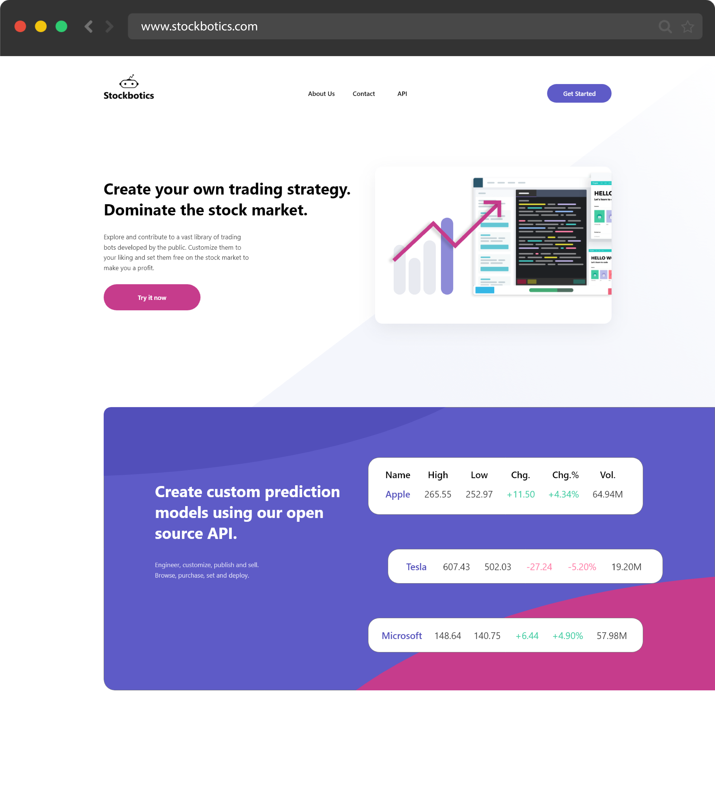
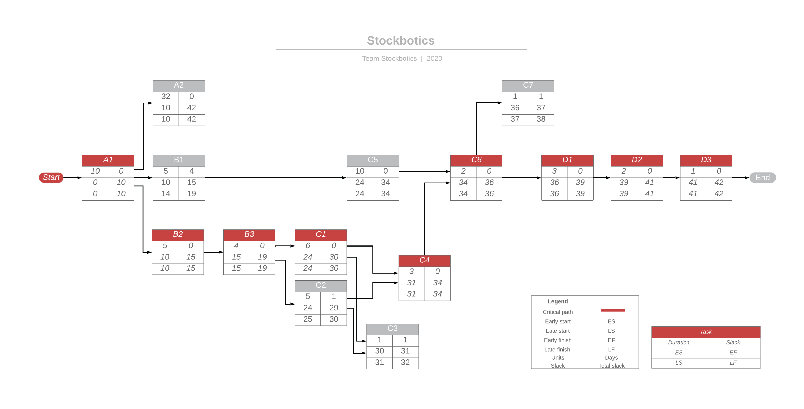

# Stockbotics™

|**Naziv projekta** | Stockbotics™|
|:---|:---|
| **Člani projektne skupine** | Šimen Ravnik, Tim Vučina, Andraž Novak, Andrej Kronovšek |
| **Kraj in datum** | Ljubljana, 15. 03. 2020 |

## Povzetek projekta

Stockboticks je oblačna platforma, ki podpira trgovanje ne samo z delnicami, amapk tudi z "boti", ki samostojno trgujejo z vrednostnimi papirji. Dodano vrednost prinaša visoka mera personalizacije na več nivojih. Uporabnik si lahko izbere "bota", ki namesto njega trguje. Lahko ga modificira po svojih željah, lahko sam naredi svoje modele in svoje principe trgovanja. Če se "bot" izkaže za uspešnega, ga uporabnik lahko proda ali pa objavi za javno uporabo. Vsak "bot" ima svojo statistiko poslovanja in navzven odprt API za integracijo z drugimi aplikacijami za napovedovanje vrednosti delnic. Stockbotics odpira nov trg na trdnih temeljih trga vrednostnih papirjev.

## 1. Motivacija

Trgovanje z delnicami v zadnjih letih postaja vedno bolj popularno. K temu so pripomogle spletne in mobilne aplikacije, ki so trgovanje prinesle v roke množic in jim omogočile možnost dodatnega zaslužka. Obenem pa skoraj ves promet na borzah temelji na algoritmičnem ali visoko frekvenčnem trgovanju.
Ali so potem te aplikacije res možnost priložnost za končnega uporabnika? Ali je to le način dodatnega zaslužka za podjetja, ki bolj natančno vedo kako ljudje trgujejo kot pa kakšna bo vrednost delnic?
Realno stanje je, da imajo podjetja preveliko premoč v primerjavi s posameznikom. Naš cilj je začetek izravnave igralnega polja na nivo, ko posameznikova naložba ne bo več orodje večje borzne hiše.

Prav tako pa bi s tem zakorakali na dokaj novo tržiše. Umetna inteligenca kot produkt. Do sedaj je bila umetna inteligenca le del večjih rešitev. Običajno je končnemu uporabniku skrita. Platforma Stockboticks bo med prvimi, ki omogoča prodajo in uporabo modelov, ki so jih razvili uporabniki sami in njihovo takojšnjo uporabo.

Naš povprečen uporabnik ima rad transparentost, rad ve točno kaj se dogaja z njegovim avtom, z njegovim telefonom, v svetu okoli njega in njegovimi financami. Spremlja najnovejše tehnološke trende, vidi kakšno dodano vrednost umetna inteligenca prinaša svetu. In najpomembnejše: želi spremeniti svet. Z nami bo spremembe spremljal iz prve vrste.

## 2. Cilji projekta in pričakovani rezultati

### 2.1 Opis ciljev

Aplikacija omogoča uporabnikom, ki si želijo izdelovati svoje napovedne modele delnic, abstrakcijo nad administracijo in jim omogoča, da se osredotočijo samo na svoj napovedni model. Torej, aplikacija omogoča enostavno pridobitev aktualnih in zgodovinskih podatkov gibanja delnic in prav tako omogoča hitro in enostavno uveljavitev svojih napovednih modelov. Omogočena je torej funkcionalnost avtomatskega trgovanja, za kar uporabniku prav tako ni potrebno samostojno skrbeti.

Funkcionalnosti omogočene uporabniku:

* registracija in sodelovanje pri izdelavi lastnih botov za trgovanje z delnicami
* enostavna pridobitev zgodovinskih in aktualnih delniških podatkov
* objava napovednih modelov na svoj profil in urejanje ali je bot javno dostopen ali zaseben
* enostavna uporaba botov za dejanske transakcije
* pregled nad statistiko napovedi preteklih transakcij, ocene uporabnikov, povprečna uspešnost posameznega bota
* pregledovanje, nakup in urejanje trgovalnih botov
* prikaz lestvice uporabnikov, ki so izdelali najbolj natančne napovedovalne modele

### 2.2 Pričakovani rezultati

Izdelek bo "single-page application" implementirana s pomočjo front-end ogrodja (npr. Angular), uporabniku vidna kot spletna stran, ki jo obišče z brskalnikom.

Zaledna logika bo implementirana kot strežniška aplikacija s pomočjo primernega (npr. Express) ogrodja in knjižnic za prikaz (npr. Bootstrap).

Podatki o transakcijah in uporabnikih bojo trajno shranjeni v relacijski bazi. Statistični podatki o delnicah pa se bojo sprotno posodabljali in shranjevali v noSQL bazo za hitrejšo odzivnost.

Ob vstopu na spletno stran bo potrebna prijava oziroma registracija v primeru, da uporabnik še nima računa.

Na vseh straneh aplikacije bo na voljo navigacijska vrstica preko katere se bo uporabnik premikal po posameznih straneh.

Prijavljen uporabnik bo imel na voljo:

* brskanje, dodajanje in brisanje botov iz privatne knjižnice.
* spreminjanje parametrov posameznega bota v njegovi lasti
* nalaganje/prenos kode napovednega modela posameznega bota
* nakup bota v trgovini objavljenih botov (ki se nato doda v privatno knjižnico)
* pregled pretekle aktivnosti in statistike lastnih in javnih botov
* pregled, naložbo in izplačilo lastih sredstev oziroma finančnega stanja
* povzet pregled statistike posameznih delnic, ki so na voljo za trgovanje

## 3. Projektni načrt

Projekt sestoji iz štirih faz, ki so logično ločene v zaključene celote in vsaka implementira posameznedele, ključne za dosego željenega cilja.

### 3.1 Povzetek razdelitve projekta na aktivnosti

**Prva faza** vsebuje zajem zahtev, opredelitev in obvladovanje tveganj, ter osnovno projektno vodenje. Torej, specificirajo so vse zahteve, ki jih je potrebno implentirati, definirajo se potencialna tveganja in njihove rešitve, ter razdelijo se vloge članov ekipe in začne se projektno vodenje, ki traja do konca projekta.

**Druga faza** vključuje razdelitev dela in nalog sodelujočih na projektu, prav tako pa vključuje tudi izdelavo osnovne grafične podobe in grafičnega vmesnika, za lažjo predstavo aplikacije tako članov ekipe kot tudi stranke. Specificira se tudi arhitektura vmesnika in njegovo delovanje, ter opredeli zasnova/shema podatkovnega skladišča.

**Tretja faza** vključuje dejansko implementacijo vseh potebnih elementov aplikacije. To so implementacija vmesnika in poslovne logike, ustrezno implementacijo podatkovnega skladišča, sprotno testiranje, izdelava grafičnega vmesnika in komunikacija s zalednim delom sistema, ter integracija vseh delov sistema v testno okolje.

**Četrta faza** vsebuje končno pisanje dokumentacije in uporabniškega vodiča, testiranje vseh delov sistema, ter pripravljanje aplikacije za integracijo v produkcijsko okolje. Nato sledi dejanska integracija sistema v produkcijsko okolje.

#### Faza 1

* zajem zahtev
* projektno vodenje

#### Faza 2

* ustvarjanje grafične podobe in grafičnega vmesnika
* specifikacija arhitekture in delovanja API vmesnika
* opredelitev sheme podatkovnega skladišča

#### Faza 3

* vzpostavitev podatkovnega skladišča
* implementacija API vmesnika ter poslovne logike
* testiranje API klicev
* implementacija grafičnega vmesnika in komunikacija z zalednim delom
* integracija podatkovnega skladišča, zalednega dela in sprednjega dela v testno okolje

#### Faza 4

* izdelava dokumentacije in uporabniškega vodiča
* testiranje
* integracija v produkcijsko okolje

### 3.2 Načrt posameznih aktivnosti

| **Oznaka aktivnosti**                               | A1                                                                            |
|-----------------------------------------------------|-------------------------------------------------------------------------------|
| **Predvideni datum pričetka izvajanja aktivnosti**  | 23. 3. 2020                                                                   |
| **Predvideni datum zaključka izvajanja aktivnosti** | 3. 4. 2020                                                                    |
| **Trajanje**                                        | 10                                                                            |
| **Naziv aktivnosti**                                | zajem zahtev                                                                  |
| **Obseg aktivnosti v ČM**                           | 1,8                                                                           |
| **Seznam ciljev aktivnosti (kaj želite doseči)**    | Opredeljena specifikacija končnega produkta.                                  |
| **Opis aktivnosti**                                 | Opredelitev vseh potrebnih zahtev in izdelava osnovne specifikacije produkta. |
| **Morebitne odvisnosti in omejitve**                | Ni odvisnosti. Je na kritični poti.                                           |
| **Pričakovani rezultati aktivnosti**                | Formalno in jedrnato izdelana specifikacija.                                  |

| **Oznaka aktivnosti**                               | A2                                                                                                                                                                    |
|-----------------------------------------------------|-----------------------------------------------------------------------------------------------------------------------------------------------------------------------|
| **Predvideni datum pričetka izvajanja aktivnosti**  | 6. 4. 2020                                                                                                                                                            |
| **Predvideni datum zaključka izvajanja aktivnosti** | 22. 5. 2020                                                                                                                                                           |
| **Trajanje**                                        | 32                                                                                                                                                                    |
| **Naziv aktivnosti**                                | projektno vodenje                                                                                                                                                     |
| **Obseg aktivnosti v ČM**                           | 1,4                                                                                                                                                                   |
| **Seznam ciljev aktivnosti (kaj želite doseči)**    | Uskladitev članov skupine, dodelitev dela in primernih aktivnosti.                                                                                                    |
| **Opis aktivnosti**                                 | Projektni vodja dodeli delo sodelujočim na projektu glede na njihove zmožnosti in sposobnosti, prav tako nadzoruje, da so posamezni deli sistema uskaljeni med seboj. |
| **Morebitne odvisnosti in omejitve**                | A1. Ni na kritični poti.                                                                                                                                              |
| **Pričakovani rezultati aktivnosti**                | Jasna navodila za člane ekipe in dobra razdelitev dela.                                                                                                               |

| **Oznaka aktivnosti**                               | B1                                                                                                                     |
|-----------------------------------------------------|------------------------------------------------------------------------------------------------------------------------|
| **Predvideni datum pričetka izvajanja aktivnosti**  | 6. 4.2020                                                                                                              |
| **Predvideni datum zaključka izvajanja aktivnosti** | 10. 4. 2020                                                                                                            |
| **Trajanje**                                        | 5                                                                                                                      |
| **Naziv aktivnosti**                                | ustvarjanje grafične podobe in grafičnega vmesnika                                                                     |
| **Obseg aktivnosti v ČM**                           | 0,3                                                                                                                    |
| **Seznam ciljev aktivnosti (kaj želite doseči)**    | Kreiranje grafične podobe produkta, izdelava grafičnega vmesnika aplikacije.                                           |
| **Opis aktivnosti**                                 | Izdelava predvidenih pogledov aplikacije, katere se uporabi kot vodilo pri izdelavi in implementaciji funkcionalnosti. |
| **Morebitne odvisnosti in omejitve**                | A1. Ni na kritični poti.                                                                                               |
| **Pričakovani rezultati aktivnosti**                | Izdelane grafični pogledi aplikacije, za lažjo predstavo aplikacje.                                                    |

| **Oznaka aktivnosti**                               | B2                                                                                                                                                                       |
|-----------------------------------------------------|--------------------------------------------------------------------------------------------------------------------------------------------------------------------------|
| **Predvideni datum pričetka izvajanja aktivnosti**  | 6. 4. 2020                                                                                                                                                               |
| **Predvideni datum zaključka izvajanja aktivnosti** | 10. 4. 2020                                                                                                                                                              |
| **Trajanje**                                        | 5                                                                                                                                                                        |
| **Naziv aktivnosti**                                | specifikacija arhitekture in delovanja API vmesnika                                                                                                                      |
| **Obseg aktivnosti v ČM**                           | 0,7                                                                                                                                                                      |
| **Seznam ciljev aktivnosti (kaj želite doseči)**    | Kreiranje usrezne specifikacije za enostavno implementacijo API vmesnika.                                                                                                |
| **Opis aktivnosti**                                 | Izdelava specifikacije API vmesnika, popis vseh končnih dostopnih točk, definiranje objektov, ki jih vrača API, izbira tehnologij, ki se pri implementaciji uporabljajo. |
| **Morebitne odvisnosti in omejitve**                | A1. Je na kritični poti.                                                                                                                                                 |
| **Pričakovani rezultati aktivnosti**                | Dobra, natančna in ustrezna specifikacija.                                                                                                                               |

| **Oznaka aktivnosti**                               | B3                                                                                                                                                    |
|-----------------------------------------------------|-------------------------------------------------------------------------------------------------------------------------------------------------------|
| **Predvideni datum pričetka izvajanja aktivnosti**  | 14. 4. 2020                                                                                                                                           |
| **Predvideni datum zaključka izvajanja aktivnosti** | 17. 4. 2020                                                                                                                                           |
| **Trajanje**                                        | 4                                                                                                                                                     |
| **Naziv aktivnosti**                                | opredelitev sheme podatkovnega skladišča                                                                                                              |
| **Obseg aktivnosti v ČM**                           | 0,4                                                                                                                                                   |
| **Seznam ciljev aktivnosti (kaj želite doseči)**    | Definiranje entitet podatkovnega skladišča in izdelava specifikacije.                                                                                 |
| **Opis aktivnosti**                                 | Opredelitev sheme podatkovne baze, izbira ustreznih tehnologij za implementacijo, točno definiranje podatkov, ki jih hranimo v podatkovnem skladišču. |
| **Morebitne odvisnosti in omejitve**                | B2. Je na kritični poti.                                                                                                                              |
| **Pričakovani rezultati aktivnosti**                | Načrt podatkovne baze.                                                                                                                                |

| **Oznaka aktivnosti**                               | C1                                                                                                                                                        |
|-----------------------------------------------------|-----------------------------------------------------------------------------------------------------------------------------------------------------------|
| **Predvideni datum pričetka izvajanja aktivnosti**  | 28. 4. 2020                                                                                                                                               |
| **Predvideni datum zaključka izvajanja aktivnosti** | 6. 5. 2020                                                                                                                                                |
| **Trajanje**                                        | 6                                                                                                                                                         |
| **Naziv aktivnosti**                                | implementacija zalednega dela (poslovne logike)                                                                                                           |
| **Obseg aktivnosti v ČM**                           | 0,7                                                                                                                                                       |
| **Seznam ciljev aktivnosti (kaj želite doseči)**    | Implementacija poslovne logike sistema, vzpostavitev komunikacije s podatkovnim skladiščem.                                                               |
| **Opis aktivnosti**                                 | S tehnologijami specificiranimi v projektnem načrtu implementirati osnovno zgradbo zalednega dela, implementacija poizvedb potebnih za delovanje sistema. |
| **Morebitne odvisnosti in omejitve**                | B3. Je na kritični poti.                                                                                                                                  |
| **Pričakovani rezultati aktivnosti**                | Delujoč zaledni del sistema.                                                                                                                              |

| **Oznaka aktivnosti**                               | C2                                                                                         |
|-----------------------------------------------------|--------------------------------------------------------------------------------------------|
| **Predvideni datum pričetka izvajanja aktivnosti**  | 28. 4. 2020                                                                                |
| **Predvideni datum zaključka izvajanja aktivnosti** | 5. 5. 2020                                                                                 |
| **Trajanje**                                        | 5                                                                                          |
| **Naziv aktivnosti**                                | vzpostavitev podatkovnega skladišča                                                        |
| **Obseg aktivnosti v ČM**                           | 0,4                                                                                        |
| **Seznam ciljev aktivnosti (kaj želite doseči)**    | Kreiranje podatkovne baze sistema z vnešenimi testnimi podatki.                            |
| **Opis aktivnosti**                                 | Vzpostavitev podatkovne baze in kreiranje testnih podatkov glede na načrt podatkovne baze. |
| **Morebitne odvisnosti in omejitve**                | B3. Ni na kritični poti.                                                                   |
| **Pričakovani rezultati aktivnosti**                | Delujoče podatkovno skladišče na katero se je možno povezati.                              |

| **Oznaka aktivnosti**                               | C3                                                                                             |
|-----------------------------------------------------|------------------------------------------------------------------------------------------------|
| **Predvideni datum pričetka izvajanja aktivnosti**  | 7. 5. 2020                                                                                     |
| **Predvideni datum zaključka izvajanja aktivnosti** | 7. 5. 2020                                                                                     |
| **Trajanje**                                        | 1                                                                                              |
| **Naziv aktivnosti**                                | testiranje delovanja zalednega dela                                                            |
| **Obseg aktivnosti v ČM**                           | 0,1                                                                                            |
| **Seznam ciljev aktivnosti (kaj želite doseči)**    | Testiranje komunikacije med zalednim delom in podatkovnim skladiščem.                          |
| **Opis aktivnosti**                                 | Preveriti ali vse poizvedbe zalednega dela delujejo pravilno in v skladu z projektnim načrtom. |
| **Morebitne odvisnosti in omejitve**                | C1, C2. Ni na kritični poti.                                                                   |
| **Pričakovani rezultati aktivnosti**                | Pravino delujoča komunikacija zalednega dela in podatkovnga skladišča.                         |

| **Oznaka aktivnosti**                               | C4                                                                                    |
|-----------------------------------------------------|---------------------------------------------------------------------------------------|
| **Predvideni datum pričetka izvajanja aktivnosti**  | 8. 5. 2020                                                                            |
| **Predvideni datum zaključka izvajanja aktivnosti** | 12. 5. 2020                                                                           |
| **Trajanje**                                        | 3                                                                                     |
| **Naziv aktivnosti**                                | impelemntacija API vmesnikov                                                          |
| **Obseg aktivnosti v ČM**                           | 0,3                                                                                   |
| **Seznam ciljev aktivnosti (kaj želite doseči)**    | V skladu z projektnim načrtom implementirati ustrazne končne točke sistema.           |
| **Opis aktivnosti**                                 | Implementacija usteznih API dostopnih točk in ustreznega pregledovanja avtentikacije. |
| **Morebitne odvisnosti in omejitve**                | C1, C2. Je na kritični poti.                                                          |
| **Pričakovani rezultati aktivnosti**                | Delujoč in varen API vmesnik                                                          |

| **Oznaka aktivnosti**                               | C5                                                                                                      |
|-----------------------------------------------------|---------------------------------------------------------------------------------------------------------|
| **Predvideni datum pričetka izvajanja aktivnosti**  | 28. 4. 2020                                                                                             |
| **Predvideni datum zaključka izvajanja aktivnosti** | 12. 5. 2020                                                                                             |
| **Trajanje**                                        | 10                                                                                                      |
| **Naziv aktivnosti**                                | implementacija grafičnega vmesnika                                                                      |
| **Obseg aktivnosti v ČM**                           | 0,9                                                                                                     |
| **Seznam ciljev aktivnosti (kaj želite doseči)**    | Implementacija končnega izgleda aplikacije.                                                             |
| **Opis aktivnosti**                                 | Iz predlog projektnega načrta izdelati delujočo dinamično aplikacijo, ki je skadna z zahtevami stranke. |
| **Morebitne odvisnosti in omejitve**                | B1. Ni na kritični poti.                                                                                |
| **Pričakovani rezultati aktivnosti**                | Delujoča "frontend" dinamična aplikacija.                                                               |

| **Oznaka aktivnosti**                               | C6                                                                                           |
|-----------------------------------------------------|----------------------------------------------------------------------------------------------|
| **Predvideni datum pričetka izvajanja aktivnosti**  | 13. 5. 2020                                                                                  |
| **Predvideni datum zaključka izvajanja aktivnosti** | 14. 5. 2020                                                                                  |
| **Trajanje**                                        | 2                                                                                            |
| **Naziv aktivnosti**                                | integracija vseh delov sistema v testno okolje                                               |
| **Obseg aktivnosti v ČM**                           | 0,3                                                                                          |
| **Seznam ciljev aktivnosti (kaj želite doseči)**    | Pravilna medsebojna povezava vseh komponent sistema.                                         |
| **Opis aktivnosti**                                 | Vsak posamezni del sistema zapakirati v docker zabojnike in jih integrirati v testno okolje. |
| **Morebitne odvisnosti in omejitve**                | C4, C5. Je na kritični poti.                                                                 |
| **Pričakovani rezultati aktivnosti**                | V celoti delujoča aplikacija v testnem okolju.                                               |

| **Oznaka aktivnosti**                               | C7                                                                                    |
|-----------------------------------------------------|---------------------------------------------------------------------------------------|
| **Predvideni datum pričetka izvajanja aktivnosti**  | 15. 5. 2020                                                                           |
| **Predvideni datum zaključka izvajanja aktivnosti** | 15. 5. 2020                                                                           |
| **Trajanje**                                        | 1                                                                                     |
| **Naziv aktivnosti**                                | testiranje integrirane aplikacije                                                     |
| **Obseg aktivnosti v ČM**                           | 0,1                                                                                   |
| **Seznam ciljev aktivnosti (kaj želite doseči)**    | Testiranje delovanja aplikacije, odkrivanje odpravljanje napak.                       |
| **Opis aktivnosti**                                 | Uporaba aplikacije in spremljanje delovanja, odpravljanje napak odkritih pri uporabi. |
| **Morebitne odvisnosti in omejitve**                | C6. Ni na kritični poti.                                                              |
| **Pričakovani rezultati aktivnosti**                | Pravilno delujoča aplikacija.                                                         |

| **Oznaka aktivnosti**                               | D1                                                                                                                                                      |
|-----------------------------------------------------|---------------------------------------------------------------------------------------------------------------------------------------------------------|
| **Predvideni datum pričetka izvajanja aktivnosti**  | 15. 5. 2020                                                                                                                                             |
| **Predvideni datum zaključka izvajanja aktivnosti** | 19. 5. 2020                                                                                                                                             |
| **Trajanje**                                        | 3                                                                                                                                                       |
| **Naziv aktivnosti**                                | izdelava dokumentacije in uporabniškega vodiča                                                                                                          |
| **Obseg aktivnosti v ČM**                           | 0,2                                                                                                                                                     |
| **Seznam ciljev aktivnosti (kaj želite doseči)**    | Izdelana ustrezna API dokumentacija in vodič za uporabnike.                                                                                             |
| **Opis aktivnosti**                                 | Dokumentiranje API dostopnih točk in opis objektov, ki jih poizvedbe vračajo. Kratka predstavitev zaslonskih mask, ki bo služila kot uporabniški vodič. |
| **Morebitne odvisnosti in omejitve**                | C6. Je na kritični poti.                                                                                                                                |
| **Pričakovani rezultati aktivnosti**                | Dobro in ustrezno dokumentiran API, izdelan vodič za uporabnike.                                                                                        |

| **Oznaka aktivnosti**                               | D2                                                                                                           |
|-----------------------------------------------------|--------------------------------------------------------------------------------------------------------------|
| **Predvideni datum pričetka izvajanja aktivnosti**  | 20. 5. 2020                                                                                                  |
| **Predvideni datum zaključka izvajanja aktivnosti** | 21. 5. 2020                                                                                                  |
| **Trajanje**                                        | 2                                                                                                            |
| **Naziv aktivnosti**                                | integracija produkta v produkcijo                                                                            |
| **Obseg aktivnosti v ČM**                           | 0,3                                                                                                          |
| **Seznam ciljev aktivnosti (kaj želite doseči)**    | Uveljavitev in integracija celotnega sistema v produkcijsko okolje.                                          |
| **Opis aktivnosti**                                 | Glede na projektni načrt integracija celotnega sistema v produkcijsko okolje, ki je namenjeno javni uporabi. |
| **Morebitne odvisnosti in omejitve**                | D1. Je na kritični poti.                                                                                     |
| **Pričakovani rezultati aktivnosti**                | Delujoča aplikacija v produkcijskem okolju.                                                                  |

| **Oznaka aktivnosti**                               | D3                                                                             |
|-----------------------------------------------------|--------------------------------------------------------------------------------|
| **Predvideni datum pričetka izvajanja aktivnosti**  | 22. 5. 2020                                                                    |
| **Predvideni datum zaključka izvajanja aktivnosti** | 22. 5. 2020                                                                    |
| **Trajanje**                                        | 1                                                                              |
| **Naziv aktivnosti**                                | testiranje in uporaba aplikacije                                               |
| **Obseg aktivnosti v ČM**                           | 0,1                                                                            |
| **Seznam ciljev aktivnosti (kaj želite doseči)**    | Testiranje delovanja aplikacije v produkcijskem okolju.                        |
| **Opis aktivnosti**                                 | Uporaba aplikacije in spremljanje delovanja aplikacije v produkcijskem okolju. |
| **Morebitne odvisnosti in omejitve**                | D2. Je na kritični poti.                                                       |
| **Pričakovani rezultati aktivnosti**                | Popolnoma delujoča aplikacija v produkcijskem okolju.                          |

### 3.3 Seznam izdelkov

| Oznaka izdelka | Ime izdelka     | Datum izdaje | 
| :------------- | :-------------- | :----------- |
| PC 1           | Seznam zahtev   | 3. 4. 2020   |
| PC 2           | Načrt projekta  | 17. 4. 2020  |
| PC 3.1         | Osnutki strani  | 10. 4. 2020  |
| PC 3.2         | Podatkovna baza | 5. 5. 2020   |
| PC 3.3         | API             | 12. 5. 2020  |
| PC 3.4         | Front-end       | 12. 5. 2020  |
| PC 4           | Aplikacija      | 16. 5. 2020  |
| PC 5           | Dokumentacija   | 19. 5. 2020  |

*PC - product component*

### 3.4 Časovni potek projekta - Ganttov diagram ([teamgantt.com][1])

### 3.5 Odvisnosti med aktivnosti - Graf PERT ([lucidchart.com][2])

#### Enostaven PERT-ov graf

#### Podrobnejši PERT-ov graf

## 4. Obvladovanje tveganj

### 4.1 Identifikacija in analiza tveganj

| Naziv tveganja                       | Vpliva na             | Opis tveganja                                                                                                                                                               | Tip tveganja                        | Verjetnost nastopa tveganja    | Posledice nastopa tveganja    |
| :----------------------------------- | :-------------------- | :-------------------------------------------------------------------------------------------------------------------------------------------------------------------------- | :---------------------------------- | :----------------------------- | :---------------------------- |
| slab projektni načrt                 | projekt in produkt    | Projektni načrt ni dobro izdelan, specifikacije niso jasne, razvijalci ne razumejo povsem, kako mora aplikacija delovati                                                    | zahteve                             | zelo visoka                    | usodne                        |
| pomanjkanje znanja                   | projekt in produkt    | Člani ekipe ne poznajo orodij, ki so ključna za implementacijo projekta                                                                                                     | orodja                              | visoka                         | zmerne                        |
| slabo projektno vodenje              | projekt in produkt    | Projektni vodja ne usklajuje delovanja ekipe, razvijalci med seboj niso usklajeni in ne morejo delovati kot ekipa                                                           | organizacijsko                      | zmerno                         | usodne                        |
| izguba člana ekipe                   | projekt               | Zaradi bolezni/smrti/potovanja ekipa ostane brez ključnega člana                                                                                                            | ljudje                              | zelo nizka                     | usodne                        |
| neresno delo člana                   | projekt               | Član ekipe ne opravlja svojih dolžnosti, njegovo delo morajo zato opravljati drugi, da je izdelek lahko narejen v roku                                                      | ljudje                              | zmerna                         | resne                         |
| podcenjena velikost projekta         | projekt               | Količina dela za izvedbo projekta se izkaže kot veliko večja od predvidene v projektnem načrtu                                                                              | ocenjevanje                         | visoka                         | resne                         |
| okvara strojne opreme                | projekt               | Članu ekipe odpove računalnik                                                                                                                                               | tehnologija                         | nizka                          | dopustne                      |
| neusklajenost pričakovanj strank     | produkt               | Stranka in razvijalci imajo drugačen pogled na končni izdelek, zato pride do nezadovoljstva stranke pri končnem produktu                                                    | zahteve                             | zmerna                         | dopustne                      |
| odpoved ponudnika platforme          | projekt in produkt    | Med projektom se zgodi, da uporabljeno orodje ni na voljo (vzdrževanje, bug, spremenjen terminski plan), (npr. Bitbucket, produkcijska platforma za končno uveljavitev.)    | tehnologija                         | nizka                          | katastrofalne                 |
| podcenjen čas za izvedbo projekta    | projekt               | Zaradi pomanjkljivih izkušenj je ocenjen čas za izvedbo projekta podcenjen                                                                                                  | ocenjevanje                         | visoka                         | resne                         |
| konkurenčni produkt                  | poslovanje            | Konkurenčni produkt je boljši/cenejši zato se stranke odločijo za uporabo konkurenčnega produkta                                                                            | organizacijsko                      | zmerna                         | dopustne                      |                    |
| napačna uporaba sistema za verzioniranje                  | produkt            | Pri izdelavi produkta in verzioniranju lahko pride do težav, ki jih je potrebno odpraviti in lahko se zgodi, da izgubimo kak del že napisane kode.                                                                            | tehnologija                      | visoka                         | dopustne                      |                    |

### 4.2 Načrtovanje tveganj

| Tveganje                            | Strategija                                                                                                                                                                                                                                         |
| :---------------------------------- | :------------------------------------------------------------------------------------------------------------------------------------------------------------------------------------------------------------------------------------------------- |
| slab projektni plan                 | V okviru projektnega načrta bomo sklicali sestanek celotne ekipe, namenjen za razjasnevanje vseh vprašanj, ki se pojavljajo in ko so vprašanja in nejasnosti razrašene, se popravi/dopolni projektni načrt in šele nato se ekipa loti razvoja.  |
| pomanjkanje znanja                  | Članom ekipe, ki določenih orodij ne bodo poznali, bodo dodatno pomoč ponudili drugi člani ekipe. Prav tako se bodo poiskala gradiva, ki bodo pomagala izpopolniti potrebna znanja.                                                                |
| slabo projektno vodenje             | Izbira dobrega projektnega vodje, ki sproti skrbi, da se člani držijo projektnega načrta ter se zavedajo, kaj je naslednja aktivnost, ki čaka implementacijo.                                                                                      |
| izguba člana ekipe                  | Vsak v skupini bo vsaj okvirno poznal delo drugih članov ekipe, prav tako bo potrebno pisanje sprotne dokumentacije, v takem primeru se potem delo člana razporedi med druge v ekipi.                                                              |
| neresno delo člana                  | Projektni vodja bo sproti spremljal delo vseh članov in skrbel, da ne bo član ekipe svojega dela prepuščal drugim.                                                                                                                                 |
| podcenjena velikost                 | Že v izdelavi projektnega načrta se bo skrbno preučilo obseg projekta.                                                                                                                                                                             |
| okvara strojne opreme               | Članu se pomaga pri nakupu nove strojne opreme/lahko dobi v začasno uporabo starejši računalnik drugih članov ekipe.                                                                                                                               |
| neusklajenost pričakovanj strank    | Stalno dogovarjanje s stranko, predstavitve vmesnih verzij bodo omogočale, da bo razvoj usklajen z zahtevami stranke.                                                                                                                              |
| odpoved ponudnika platforme         | Projekt bo zaključen nekaj dni pred končnim rokom, da lahko v primeru odpovedi zamenjamo storitev, oz. počakamo, da je predvidena storitev ponovno vzpostavljena.                                                                                  |
| podcenjen čas za izvedbo projekta   | Že v projektnem načrtu bo zajetih nekaj dodatnih dni, ki bodo namenjeni za primer, da je časovni obseg podcenjen.                                                                                                                                  |
| konkurenčni produkt                 | Stalno opazovanje razvoja konkurenčnega produkta in izboljševanje funkcionalnosti, hkrati pa upoštevanje ekipne miselnosti, ki nas bo pripeljala do boljšega produkta.                                                                             |
| napačna uporaba sistema za verzioniranje                 | Navodila za delo s sistemom za verzioniranje bodo jasna in se jih bomo držali. Naš napredek bomo redno shranjevali in uporabljali IDE-je, ki omogočajo lokalno zgodovino ter komunicirali med sabo.                                                                             |

## 5. Upravljanje projekta

Organizacije smo se lotili sistematično. Odprli smo si Slack domeno, v kateri konstantno komuniciramo glede stanja projekta. Prav tako se vsak dan slišimo preko Discorda na konferenčnem klicu in si izmenjamo informacije o projektu.
Sistem verzioniranja, ki ga uporabljamo je GitHub, saj je to sistem, s katerim smo vsi najbolj seznanjeni. Delali bomo s tremi vejami in sicer master, integration in development vejami, kjer je master veja produkcija, integration veje so veje v katerih so združene rešitve in na katerih posledično testiramo naš produkt ter development v kateri se razvija ena specifična stvar.
Če bomo opazili, da preglednost projekta ni takšna, kot bi si želeli, bomo uporabili še Trello ali kakšno drugo aplikacijo za lažje sledenje opravljenega dela.

## 6. Predstavitev skupine

Andrej Kronovšek, starost 21, univerzitetni študent na Fakulteti za računalništvo in informatiko, Univerze v Ljubljani. Ima izkušnje z vodenjem projektov in je zato vodja projektne skupine. Prav tako ima full-stack znanje in bo zato obvladoval povezovanje med zalednim in sprednjim delom aplikacije in nadzoroval kriterije za ustrezno implementacijo. Znanje PHP, Python, JavaScript, HTML, CSS, TypeScript.

Tim Vučina, starost 21, univerzitetni študent na Fakulteti za računalništvo in informatiko, Univerze v Ljubljani. Ima izredno dober občutek za grafično oblikovanje in bo zato glavni pri razvoju sprednjega dela aplikacije, prav tako pa bo sodeloval pri razvoju osnovnega napovednega modela. Znanje JavaScript, HTML, CSS, TypeScript, JQuery, Python. 

Andraž Novak, starost 22, univerzitetni študent na Fakulteti za računalništvo in informatiko, Univerze v Ljubljani. Zaradi izkušenj pri razvoju aplikacij skrbi za zaledni del aplikacije, poslovno logiko, ki je potrebna v aplikaciji. Odgovoren za specifikacijo vmesnikov in celotnega API-ja. Znanje Java, Docker, Python, PHP, JavaScript, SQL, C.

Šimen Ravnik, starost 21, univerzitetni študent na Fakulteti za računalništvo in informatiko, Univerze v Ljubljani. Prav tako skrbi za zaledni del aplikacije, razvoj API-ja, odgovoren za pravilno povezovanje z bazo sistema, torej za hitre poizvedbe, ki bojo problematične zaradi velike količine podatkov. Sodeluje tudi pri razvoju osnovnega napovednega modela. Znanje Java, Docker, Python, JavaScript, SQL, MongoDB, C.

## 7. Finančni načrt - COCOMO II ocena

### Specifikacija stroškov

V projektu smo upoštevali, da ena ura stane 20 evrov, 1 ČM je enak 60 uram, torej 1 ČM stane 1200 evrov.

| Oznaka | Aktivnost                               | ČM  | Stroški dela | Stroški investicij     | Potni stroški | Drugi stroški       | Skupaj |
|:-------|:----------------------------------------|:----|:-------------|:-----------------------|:--------------|:------------------- |:-------|
| A1     | Zajem zahtev                            | 1,8 | 2160         | 520 - WebStorm licence | 0             | 0                   | 2680   |
| A2     | Projektno vodenje                       | 1,4 | 1680         | 30 - Atlassian         | 0             | 0                   | 1710   |
| B1     | Ustvarjanje grafične podobe             | 0,3 | 360          | 200 - Adobe            | 0             | 0                   | 560    |
| B2     | Specifikacija arhitekture               | 0,7 | 840          | 20 - HackMD            | 0             | 0                   | 860    |
| B3     | Opredelitev sheme podatkovne baze       | 0,4 | 480          | 0                      | 0             | 0                   | 480    |
| C1     | Implementacija zalednega dela           | 0,7 | 840          | 0                      | 0             | 0                   | 840    |
| C2     | Vzpostavitev podatkovnega skladišča     | 0,4 | 480          | 0                      | 0             | 0                   | 480    |
| C3     | Testiranje zalednega sistema            | 0,1 | 120          | 0                      | 0             | 0                   | 120    |
| C4     | Implementacija API                      | 0,3 | 360          | 0                      | 0             | 0                   | 360    |
| C5     | Integracija grafičnega vmesnika         | 0,9 | 1080         | 0                      | 0             | 0                   | 1080   |
| C6     | Integracija komponent v testno okolje   | 0,3 | 360          | 0                      | 0             | 0                   | 360    |
| C7     | Testiranje integrirane aplikacije       | 0,1 | 120          | 0                      | 0             | 0                   | 120    |
| D1     | Izdelava dokumentacije                  | 0,2 | 240          | 0                      | 0             | 0                   | 240    |
| D2     | Integracija v produkcijsko okolje       | 0,3 | 360          | 1000 - Strežnik        | 0             | 0                   | 1360   |
| D3     | Testiranje in uporaba aplikacije        | 0,1 | 120          | 0                      | 0             | 400 - Oglaševanje   | 520    |

Skupni stroški: 11.770

### COCOMO 2 ([softwarecost.org][3])

#### Rezulatati

## Reference

[1]: https://www.teamgantt.com/
1. https://www.teamgantt.com/, izdelava Ganttovega diagrama, (15. marec 2020).

[2]: https://www.lucidchart.com/
2. https://www.lucidchart.com/, izdelava grafov PERT, (15. marec 2020).

[3]: http://softwarecost.org/tools/COCOMO/
3. http://softwarecost.org/tools/COCOMO/, COCOMO II, (15. marec 2020).
