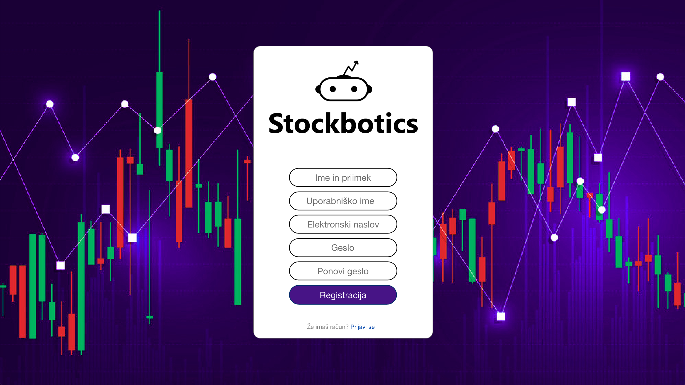

# Dokument zahtev

## Povzetek projekta

Delnice so bile od vedno popularne, predstavljajo namreč preprost zaslužek. Z malo sreče in znanja pa se lahko naše finančno stanje kar hitro dvigne.

Naš cilj je izdelati aplikacijo oziroma simulator, ki bo dal vpogled na trgovanje z delnicami s pomočjo trgovalnih botov. Uporabnik bo lahko kreiral svojega trgovalnega bota, kateremu bo lahko povedal kaj naj pri odločitvi upošteva.

Sliši se zapleteno, vendar bistvo naše aplikacije je, da uporabnik ne potrebuje razumevanja kako se trgovalni bot odloča in kaj se dogaja v ozadju. Za pravilno delovanje poskrbimo mi.

Trgovalni bot bo nato avtonomno sledil trendu spreminjanja delnic in se sam odločal ali jih bo kupil ali prodal. Uporabnik se bo tako učil in s popravljanjem svojih napak dosegal vedno boljše rezultate. Pridobil bo realno sliko trgovanja delnic s trgovalnimi boti.

## 1. Uvod

Naša aplikacija se bo ukvarjala s problemom financ in delnic. Vsi poznamo delnice, vendar zelo malo ljudi pa se dejansko na njih spozna in zna pravilno napovedovati njihov trend. Prav tako pa je jasno, da zna računalnik s podatki in številkami veliko bolje, predvsem pa hitreje kot človek. Dober trgovalni bot bi znal na podlagi starih delniških podatkov, bolje napovedati njihov trend. Računalnik lažje prepozna vzorec v številkah in podatkih, moramo mu le povedati kako.

Naš cilj je torej narediti aplikacijo, ki se bo ukvarjala z delniškimi podatki. Uporabnik se bo tako učil o trgovanju z delnicami, na voljo bo imel virtualni denar, s katerim bo lahko upravljal. Preko API-ja bo aplikacija pridobila realne podatke delnic podjetij. Uporabnik bo lahko kreiral svojega trgovalnega bota, ki bo na podlagi strojnega učenja avtonomno trgoval. Uporabnik mu bo lahko nastavil parametre delovanja. Te parametri niso povezani z razumevanjem strojnega učenja, zato je naša aplikacija izredno preprosta za uporabo. Vendar pa nastavljeni parametri vseeno vplivajo na njegovo delovanje.

Ko bo trgovalni bot kreiran, bo uporabnik bota lahko zagnal. Trgovalni bot bo začel slediti delnicam ter se na podlagi njih tudi odločati. Preko API-ja bo dobil podatke o koeficientu naraščanja oziroma padanja, pri tem bo upošteval parameter napovedi - za koliko vnaprej naj napove. Na podlagi parametra prodaje in nakupa pa se bo odločil kaj storiti. Ali naj delnico kupi, če ja koliko naj investira? Druga možnost pa je seveda, če ima delnico že zakupljeno, ali naj jo proda? Vsak trgovalni bot bo enkrat na dan preko API-ja preveril napovedi in se na podlagi njih odločil. Trgovalni bot se ne bo odločal samo o prodaji in nakupu, temveč tudi o razporejanju denarja, ki mu ga je uporabnik namenil – parameter investicije. Ko se bo odločil, bo izvedbo te akcije zgolj simuliral. Delnic ne bo dejansko kupil ali pa prodal.

Če s trgovalnim botom uporabnik ne bo zadovoljen, ga bo seveda lahko izbrisal ali pa mu uredil parametre delovanja. Navaden uporabnik ima število botov omejeno na tri, super uporabnik pa na deset.Uporabnik sam bo lahko vizualno spremljal trend naraščanja ali padanja delnic na preglednem prikazu in tako sledil odločitvam trgovalnega bota. Vse svoje trgovalne bote bo lahko uporabnik spremljal in opazoval v svoji privatni knjižnici. Ob kliku na izbranega trgovalnega bota, se mu bodo prikazali podrobni podatki o trgovanju. Uporabnik bo imel na voljo tudi trgovino, kjer bo lahko kupil trgovalne bote od že uveljavljenih super uporabnikov. Bote se bo lahko primerjalo na podlagi ocene, izračunane na podlagi dobitkov in izgub.

Trgovalni bot bo nemoteno deloval, dokler ne bo ustavljen s strani uporabnika. Uporabnik bo torej lahko trgovalnega bota ustavil in tudi ponovno zagnal. S samim delovanjem bota bo uporabnik ali pridobival ali pa zapravljal svoj virtualni denar. Stanje se mu bo zmanjšalo, ko bo trgovalnega bota zagnal - odštelo se mu bo toliko kot je parameter investicije. Virtualno stanje pa se mu bo povečalo ob prodaji delnic, ko bo uporabnik trgovalnega bota ustavil.

Ko bo uporabnik dosegel 5000€ bo iz navadnega uporabnika postal super uporabnik. Super uporabnik lahko postane tudi če se znajde med top desetimi igralci na lestvici. Super uporabnik bo imel možnost, da bo svoje trgovalne bote lahko tudi prodajal. Nadgradnjo v super uporabnika lahko navadni uporabnik tudi zavrne.

Na podlagi trgovalnih botov in uporabnikovega virtualnega stanja, bo izdelana tudi lestvica. Lestvica bo služila kot motivacija za vse uporabnike. Aktivno bo spodbujala tekmovalnost in željo, da se tudi sam znajdeš med najboljšimi. Lestvica bo rangirala uporabnike na podlagi ocene uporabnika. Ocena uporabnika bo zajemala vse uporabnikove trgovalne bote, njihove dobičke in izgube.

Poleg navadnega in super uporabnika, bo aplikacija poznala še dve uporabniški vlogi. To sta gost in skrbnik. Gost je vsak uporabnik, ki se znajde na strani naše aplikacije in ni ne registriran, ne prijavljen. Imel bo omejen pogled na aplikacijo. Videl bo le prikaz delnic. Skrbnik pa ima administrativne pravice in bo skrbel za gladko delovanje aplikacije. Brisal bo lahko neaktivne uporabnike. Ko bo skrbnik izbrisal uporabnika, se bodo ustavili in izbrisali tudi vsi njegovi trgovalni boti. Izbrisani bodo tudi iz trgovine.

Paziti je treba tudi na nefunkcionalne zahteve. Podatki uporabnikov morajo biti skladni z uredbo GDPR. Zaradi zaupnih podatkov, mora biti dostop do strežnikov podatkov na voljo samo skrbnikom. Paziti je treba, da se v bazo ne shrani kar celo geslo, ampak se ga prej pretvori v zgoščeno vrednost.

Aplikacija ne sme biti žaljiva na noben način, zato je pred objavo treba preveriti imena trgovalnih botov, uporabnikov in opise trgovalnih botov.

Aplikacija je na voljo na javno dostopnem spletnem naslovu. Dosegljiva je 99% časa v letu, kar predstavlja 3,6 ur mesečno. Odzivni čas sistema ob normalnem delovanju mora biti pod 1,5 sekunde. Zagotavljati pa mora uporabo aplikacije vsaj 500 uporabnikom hkrati.

Mora biti odporna na DDos napade. Omogočati mora enostavno dodajanje novih funkcionalnosti. Pomembno pa je tudi, da se v primeru napake med posodabljanjem podatkov v bazi vse povezane spremembe razveljavijo.

## 2. Uporabniške vloge

### Gost

Gost je najbolj osnoven uporabnik aplikacije. Gost je vsak obiskovalec aplikacije, ki še ni registriran ali pa je trenutno odjavljen. Ta uporabnik je lahko kdorkoli, zato nima omogočenih veliko funkcionalnosti. Vidi lahko le strani za prijavo in registracijo in prikaz delnic. Na delovanje aplikacije ne more vplivati. V kolikor je v aplikaciji že registriran se lahko prijavi, če ne pa registrira.

### Navadni uporabnik

Navadni uporabnik je uporabnik, ki je registriran in že prijavljen v aplikacijo. Omogočene so mu skoraj vse funkcionalnosti kot super uporabniku, razen možnost prodaje svojih trgovalnih botov v trgovini. Kreira nove trgovalne bote, jih spreminja ali izbriše. Kupi jih lahko tudi v trgovini. V privatni knjižnici ima lahko največ tri trgovalne bote. Vsi trgovalni boti so prikazani v njegovi privatni knjižnici. Ogleduje si lahko trende delnic, pretekle akcije in ostale podrobnosti svojih trgovalnih botov in lestvico. Trgovalnega bota lahko ročno zažene ali pa ustavi. Svoj profil pa lahko ureja in na njem spremlja svoje virtualno stanje. Navadni uporabnik je lahko nadgrajen v super uporabnika. Seveda pa ima tudi možnost odjave.

### Super uporabnik

Super uporabnik je uporabnik, ki je registriran in prijavljen v aplikacijo. Preden je postal super uporabnik je bil navaden uporabnik. Ko navaden uporabnik doseže 5000€, je le-ta nagrajen tako, da se ga poviša v super uporabnika. Nadgradnjo lahko tudi zavrne. Super uporabnik je razširjen navadni uporabnik. Na voljo ima povsem enake funkcionalnosti. Zaradi izkušenj pa ima še možnost dodajanja svojih botov v trgovini. V privatni knjižnici ima lahko deset trgovalnih botov.

### Skrbnik

Skrbnik je uporabnik, ki ima nadzor nad aplikacijo in njenim delovanjem. Ima administrativne pravice nad aplikacijo. Njegov cilj ni kreiranje botov in trgovanje z le-temi. Skrbnik ima omejene funkcionalnosti, ki vplivajo na delovanje in organiziranost same aplikacije. Skrbnik lahko vidi in uredi svoj profil, lahko briše neaktivne uporabnike in se odjavi. Ko skrbnik izbriše uporabnika, se izbrišejo tudi vsi njegovi boti.

## 3. Slovar pojmov

| Pojem                                          | Razlaga pojma                                                                                                                                                                                                                                                                          |
| ---------------------------------------------- | -------------------------------------------------------------------------------------------------------------------------------------------------------------------------------------------------------------------------------------------------------------------------------------- |
| Sistem                                         | Sistem je celota programske in strojne opreme , grafičnega uporabniškega vmesnika naše aplikacije.                                                                                                                                                                                     |
| Uporabnik                                      | Kdor uporablja našo spletno aplikacijo glede na namenskost oziroma uporabniško vlogo. Njegova uporabniška vloga je v tekstu specificirana predhodno, ali pa je splošna: oseba ima lahko vlogo gosta, navadnega uporabnika, super uporabnika ali skrbnika.                              |
| Neaktiven uporabnik                            | Uporabnik, ki se je nazadnje prijavil pred najmanj 90 dnevi.                                                                                                                                                                                                                           |
| Grafični uporabniški vmesnik                   | Grafični uporabniški vmesnik je vmesnik med uporabnikom in računalnikom oziroma programsko opremo. Omogoča lažjo komunikacijo uporabnika s sistemom. Uporabnik lahko z miško in tipkovnico upravlja z ikonami, okni, in drugimi gradniki, ki so del grafičnega uporabniškega vmesnika. |
| Uporabniški račun/Račun/Profil                 | Uporabniški račun je entiteta sestavljena iz uporabniškega imena in drugih parametrov, katere uporabnik nastavlja/uporablja v spletni aplikaciji.                                                                                                                                      |
| Neregistrirani uporabnik                       | Neregistrirani uporabnik je uporabnik, ki še nima uporabniškega računa.                                                                                                                                                                                                                |
| Alfanumerični znak                             | Številka ali črka                                                                                                                                                                                                                                                                      |
| Uporabniško ime                                | Enoznačno zaporedje alfanumeričnih znakov, ki enolično določajo uporabnika.                                                                                                                                                                                                            |
| Geslo                                          | Samo uporabniku vsaj osem znakov dolgo zaporedje, ki vsebuje vsaj eno številko in vsebuje vsaj en nealfanumeričen znak.                                                                                                                                                                |
| Prijava                                        | Proces pri katerem gost z vpisom uporabniškega imena in gesla spremeni uporabniško vlogo in postane navaden uporabnik, super uporabnik ali skrbnik.                                                                                                                                    |
| Registracija                                   | Proces, pri katerem si neregistrirani uporabnik ustvari nov uporabniški račun.                                                                                                                                                                                                         |
| Odjava                                         | Proces, pri katerem navadni uporabnik, super uporabnik ali pa skrbnik spremenijo vlogo v spletni aplikaciji in postanejo gost.                                                                                                                                                         |
| Vnosno polje/Polje                             | Element v spletni aplikaciji, ki uporabniku omogoča vnašanje teksta.                                                                                                                                                                                                                   |
| Delnica                                        | Delnica je vrednostni papir, ki izkazuje pravico do deleža pri glavnici in dobičku delniške družbe.                                                                                                                                                                                    |
| Trgovalni bot/Bot                              | Trgovalni bot je program, ki s pomočjo napovednega modela umetne inteligence z delnicami trguje namesto uporabnika.                                                                                                                                                                    |
| Virtualni denar                                | Virtualni denar je denar, ki nima resnične vrednosti, uporablja se kot simbolni denar v naši aplikaciji za trgovanje. Valuta virtualnega denarja je evro.                                                                                                                              |
| Virtualno stanje                               | Virtualno stanje je vsota virtualnega denarja, katero si v trenutku lasti uporabnik.                                                                                                                                                                                                   |
| Privatna knjižnica                             | Privatna knjižnica je zbirka trgovalnih botov, katere si uporabnik lasti. Bodisi jih je kreiral sam, bodisi jih je kupil.                                                                                                                                                              |
| Trgovina                                       | Trgovina je zbirka vseh trgovalnih botov, katere so uporabniki kot lastniki dodali v prodajo.                                                                                                                                                                                          |
| Objavljen trgovalni bot                        | Objavljen trgovalni bot, je bil predhodno dodan v trgovino.                                                                                                                                                                                                                            |
| Parametri delovanja/parametri trgovalnega bota | Parametri trgovalnega bota so parametri, katere lahko lastnik trgovalnega bota nastavlja in s tem spreminja uspešnost oziroma dobičkonosnost trgovalnega bota.                                                                                                                         |
| Parameter izbire števila delnic                | Parameter izbire števila delnic je parameter trgovalnega bota, ki omogoča nastavitev maksimalnega števila različnih delnic v katere lahko trgovalni bot investira.                                                                                                                     |
| Parameter investicije                          | Parameter investicije je parameter trgovalnega bota, ki omogoča nastavitev količine virtualnega denarja, katerega uporabnik nameni posameznemu trgovalnemu botu za trgovanje. Pričakovan vnešen znesek je delež uporabnikovega virtualnega stanja v evrih.                             |
| Parameter napovedi                             | Parameter napovedi je parameter trgovalnega bota, ki omogoča nastavitev časovnega obdobja, za katerega trgovalni bot izračuna predikcijo oziroma napoved trenda delnice. Parameter bo podan v dnevih.                                                                                  |
| Koeficient spreminjanja vrednosti delnice      | Koeficient spreminjanja vrednosti delnice, je količina, ki izraža razmerje spreminjanja cene delnice na časovno enoto. Izraža hitrost padanja/naraščanja delnice.                                                                                                                      |
| Parameter prodaje                              | Parameter prodaje je parameter trgovalnega bota, ki omogoča nastavitev kritične vrednosti koeficienta spreminjanja vrednosti delnic. V kolikor je na podlagi napovedi izračunan koeficient spreminjanja vrednosti delnice manjši od parametra prodaje, trgovalni bot delnice proda.    |
| Parameter nakupa                               | Parameter nakupa je parameter trgovalnega bota, ki omogoča nastavitev kritične vrednosti koeficienta spreminjanja vrednosti delnic. V kolikor je na podlagi napovedi izračunan koeficient spreminjanja vrednosti delnice večji od parametra nakupa, trgovalni bot delnice kupi.        |
| Napovedni model                                | Model oziroma funkcija, ki na podlagi zgodovine oziroma znanih vrednosti, vzorcev neke lastnosti omogoča napovedovanje te lastnosti.                                                                                                                                                   |
| API                                            | Aplikacijski programski vmesnik, (angleško application programming interface, API) je množica funkcij in procedur, ki omogočajo izdelavo aplikacije, ki dostopa do funkcij storitve, katere izpostavimo preko APIja.                                                                   |
| Strojno učenje                                 | Strojno učenje je pridobivanje znanja iz izkušenj, gre za učenje pri katerem algoritem išče vzorce v znanih podatkih.                                                                                                                                                                  |

## 4. Diagram primerov uporabe

## 5. Funkcionalne zahteve

### 1) Registracija

#### Povzetek funkcionalnosti

Gost se lahko registrira v sistem preko grafičnega uporabniškega vmesnika.

#### Osnovni tok

1. Sistem prikaže ustrezno besedilo o morebitni registraciji.
2. Gost klikne na besedilo.
3. Sistem prikaže vnosna polja za uporabniško ime, ime, priimek, elektronski naslov in geslo, ki ga mora ponoviti v zadnjem vnosnem polju.
4. Gost vpiše ustrezne podatke.
5. Gost potrdi vpisane podatke.
6. Sistem prikaže ustrezno sporočilo o uspešni registraciji.

#### Izjemni tok

##### Izjemni tok 1

1. Sistem prikaže ustrezno besedilo o morebitni registraciji.
2. Gost klikne na besedilo.
3. Sistem prikaže vnosna polja za uporabniško ime, ime, priimek, elektronski naslov in geslo, ki ga mora ponoviti v zadnjem vnosnem polju.
4. Gost izpolni zahtevane podatke, vendar pri tem vpiše že uporabljeno uporabniško ime ali elektronski naslov.
5. Gost potrdi vpisane podatke.
6. Sistem prikaže primerno sporočilo in ne registrira uporabnika.

##### Izjemni tok 2

1. Sistem prikaže ustrezno besedilo o morebitni registraciji.
2. Gost klikne na besedilo.
3. Sistem prikaže vnosna polja za uporabniško ime, ime, priimek, elektronski naslov in geslo, ki ga mora ponoviti v zadnjem vnosnem polju.
4. Gost izpolni zahtevane podatke, vendar pri vnašanju naslova elektronske pošte ne vpiše veljavnega naslova.
5. Gost potrdi vpisane podatke.
6. Sistem prikaže primerno sporočilo in ne registrira uporabnika.

##### Izjemni tok 3

1. Sistem prikaže ustrezno besedilo o morebitni registraciji.
2. Gost klikne na besedilo.
3. Sistem prikaže vnosna polja za uporabniško ime, ime, priimek, elektronski naslov in geslo, ki ga mora ponoviti v zadnjem vnosnem polju.
4. Gost izpolni zahtevane podatke, vendar pri tem vpiše geslo, ki ni dolgo vsaj osem znakov ali ne vsebuje vsaj ene številke ali ne vsebuje vsaj enega nealfanumeričnega znaka.
5. Gost potrdi vpisane podatke.
6. Sistem prikaže primerno sporočilo in ne registrira uporabnika.

##### Izjemni tok 4

1. Sistem prikaže ustrezno besedilo o morebitni registraciji.
2. Gost klikne na besedilo.
3. Sistem prikaže vnosna polja za uporabniško ime, ime, priimek, elektronski naslov in geslo, ki ga mora ponoviti v zadnjem vnosnem polju.
4. Gost izpolni zahtevane podatke, vendar pri tem v polje za ponovitev gesla vpiše napačno geslo
5. Gost potrdi vpisane podatke.
6. Sistem prikaže primerno sporočilo in ne registrira uporabnika.

#### Pogoji

Uporabnik mora imeti vlogo gosta.
Funkcionalnost registracija v sistem je namenjena zgolj neregistriranim uporabnikom. Vsak račun ima svoj unikaten elektronski
naslov in uporabniško ime.

#### Posledice

Po izvedbi se gost registrira v sistem. To pomeni, da se njegovi podatki zapišejo v bazo, sam pa lahko prične uporabljati
aplikacijo kot prijavljen uporabnik.

#### Posebnosti

Upoštevati je potrebno, katere znake je potrebno vnesti v posamezno polje. Npr. v polje ime in priimek je potrebno vnesti le
alfanumerične znake, v polje geslo pa je potrebno vnesti poleg alfanumeričnih znakov še eno številko, en nealfanumerični znak,
skupna dolžina pa mora bit vsaj osem ali več znakov.

#### Prioritete identificiranih funkcionalnosti

- MUST

#### Sprejemni testi

| Funkcija, ki se testira | Začetno stanje sistema                                                    | Vhod                                                                                                                    | Pričakovan rezultat                                                                                                                             |
| ----------------------- | ------------------------------------------------------------------------- | ----------------------------------------------------------------------------------------------------------------------- | ----------------------------------------------------------------------------------------------------------------------------------------------- |
| Registracija v sistem   | Uporabnik je na domači strani in ni prijavljen\. Torej je v vlogi gosta\. | Gost se želi registrirati v sistem in pri tem pravilno izpolni vsa vnosna polja\.                                       | Gost se je uspešno registriral\. Sistem prikaže ustrezno sporočilo\. Stran, na kateri se nahaja, se spremeni\. Preusmeri ga na prijavno stran\. |
| Registracija v sistem   | Uporabnik je na domači strani in ni prijavljen\. Torej je v vlogi gosta\. | Gost se želi registrirati v sistem in pri tem pusti vsaj eno vnosno polje prazno\.                                      | Gost se ni registriral\. Sistem prikaže ustrezno sporočilo\. Stran, na kateri se nahaja, se ne spremeni\. Torej, ostane pri registraciji\.      |
| Registracija v sistem   | Uporabnik je na domači strani in ni prijavljen\. Torej je v vlogi gosta\. | Gost se želi registrirati v sistem in pri tem vnese dve različni gesli\.                                                | Gost se ni registriral\. Sistem prikaže ustrezno sporočilo\. Stran, na kateri se nahaja, se ne spremeni\. Torej, ostane pri registraciji\.      |
| Registracija v sistem   | Uporabnik je na domači strani in ni prijavljen\. Torej je v vlogi gosta\. | Gost se želi registrirati v sistem in pri tem vnese neveljaven naslov elektronske pošte\.                               | Gost se ni registriral\. Sistem prikaže ustrezno sporočilo\. Stran, na kateri se nahaja, se ne spremeni\. Torej, ostane pri registraciji\.      |
| Registracija v sistem   | Uporabnik je na domači strani in ni prijavljen\. Torej je v vlogi gosta\. | Gost se želi registrirati v sistem in pri tem uporabi naslov elektronski pošte, ki ga uporablja že en račun v sistemu\. | Gost se ni registriral\. Sistem prikaže ustrezno sporočilo\. Stran, na kateri se nahaja, se ne spremeni\. Torej, ostane pri registraciji\.      |
| Registracija v sistem   | Uporabnik je na domači strani in ni prijavljen\. Torej je v vlogi gosta\. | Gost se želi registrirati v sistem in pri izpolnjevanju vnosnih polj uporabi nealfanumerični znak\.                     | Gost se ni registriral\. Sistem prikaže ustrezno sporočilo\. Stran, na kateri se nahaja, se ne spremeni\. Torej, ostane pri registraciji\.      |
| Registracija v sistem   | Uporabnik je na domači strani in ni prijavljen\. Torej je v vlogi gosta\. | Gost se želi registrirati v sistem in pri izpolnjevanju vnosnega polja za geslo ne uporabi prave strukture\.            | Gost se ni registriral\. Sistem prikaže ustrezno sporočilo\. Stran, na kateri se nahaja, se ne spremeni\. Torej, ostane pri registraciji\.      |

### 2) Prijava

#### Povzetek funkcionalnosti

Gost se lahko prijavi v sistem. Na osnovi njegovega uporabniškega imena sistem ugotovi uporabniško vlogo.

#### Osnovni tok

1. Uporabnik se nahaja na strani za prijavo.
2. Sistem prikaže dve vnosni polji in gumb za prijavo.
3. Uporabnik v prvo polje vpiše uporabniško ime.
4. Uporabnik v drugo polje vpiše geslo.
5. Uporabnik klikne na gumb za prijavo.
6. Uporabniku se prikaže domača stran sistema.

#### Izjemni tokovi

##### Izjemni tok 1

1. Uporabnik se nahaja na strani za prijavo.
2. Sistem prikaže dve vnosni polji in gumb za prijavo. Prvo vnosno polje je za uporabniško ime, drugo pa za geslo.
3. Gost pusti vsaj eno polje prazno.
4. Gost potrdi svojo izbiro.
5. Sistem preko sporočila javi, da je uporabniško ime ali geslo napačno.

##### Izjemni tok 2

1. Uporabnik se nahaja na strani za prijavo.
2. Sistem prikaže dve vnosni polji in gumb za prijavo. Prvo vnosno polje je za uporabniško ime, drugo pa za geslo.
3. Gost izpolni prvo polje, izpolni drugo polje. Pri enem izmed vnosov naredi napako.
4. Gost potrdi svojo izbiro.
5. Sistem preko sporočila javi, da je uporabniško ime ali geslo napačno.

#### Pogoji

Uporabnik mora biti že registriran in je v vlogi gosta.

#### Posledice

Zadnja aktivnosti uporabnika se posodobi v bazi. Po koncu osnovnega toka se vloga gosta spremeni. Postane lahko uporabnik, super uporabnik ali skrbnik, če ima te pravice.

#### Posebnosti

Posebnost ni.

#### Prioritete identificiranih funkcionalnosti

- MUST

#### Sprejemni testi

| Funkcija, ki se testira | Začetno stanje sistema                                 | Vhod                                               | Pričakovani rezultat                                                                                     |
| ----------------------- | ------------------------------------------------------ | -------------------------------------------------- | -------------------------------------------------------------------------------------------------------- |
| Prijava v sistem        | Uporabnik je na strani za prijavo\. Je v vlogi gosta\. | Uporabnik vnese uporabniško ime in geslo\.         | Gost se uspešno prijavi in postane uporabnik, super uporabnik ali skrbnik\. Preumeri ga na domačo stran. |
| Prijava v sistem        | Uporabnik je na strani za prijavo\. Je v vlogi gosta\. | Uporabnik vsaj eno vnosno polje pusti prazno\.     | Sistem preko sporočila javi, da manjka podatek. Uporabnik ostane na isti strani.                         |
| Prijava v sistem        | Uporabnik je na strani za prijavo\. Je v vlogi gosta\. | Uporabnik vnese napačno uporabniško ime in geslo\. | Sistem javi, da je uporabniško ime ali geslo napačno\. Uporabnik ostane na isti strani.                  |

### 3) Prikaz podrobnosti uporabnika

#### Povzetek funkcionalnosti

Navadnemu uporabniku ali super uporabniku se na domači strani prikazujejo ime, priimek in količina virtualnega denarja.

#### Osnovni tok

1. Sistem na domači strani prikaže podatke uporabnika.
2. <em>Razširitvena točka "Urejanje nastavitev profila": </em>  
   Uporabnik klikne na spustni meni in na gumb za urejanje profila, tok se nadaljuje v "Urejanje nastavitev profila".
3. <em>Razširitvena točka "Odjava": </em>  
   Uporabnik klikne na spustni meni in na gumb za odjavo, tok se nadaljuje v "Odjava".

#### Alternativni tokovi

#### Alternativni tok 1

1. Sistem skrbniku prikazuje samo ime in priimek.
2. <em>Razširitvena točka "Urejanje nastavitev profila": </em>  
   Uporabnik klikne na spustni meni in na gumb za urejanje profila, tok se nadaljuje v "Urejanje nastavitev profila".
3. <em>Razširitvena točka "Odjava": </em>  
   Uporabnik klikne na spustni meni in na gumb za odjavo, tok se nadaljuje v "Odjava".

#### Pogoji

Uporabnik mora biti prijavljen in v vlogi navadnega uporabnika, super uporabnika ali skrbnika.

#### Posledice

Ni posledic.

#### Posebnosti

Posebnosti ni.

#### Prioritete identificiranih funkcionalnosti

- MUST

#### Sprejemni testi

| Funkcija, ki se testira       | Začetno stanje sistema                                                                  | Vhod | Pričakovan rezultat                                                                               |
| ----------------------------- | --------------------------------------------------------------------------------------- | ---- | ------------------------------------------------------------------------------------------------- |
| Prikaz podrobnosti uporabnika | Uporabnik je na domači strani in je v vlogi navadnega uporabnika ali super uporabnika\. | -    | Uporabniku se na domači strani pravilno prikazujejo ime, priimek in količina virtualnega denarja. |
| Prikaz podrobnosti uporabnika | Uporabnik je na domači strani in je v vlogi skrbnika\.                                  | -    | Uporabniku se na domači strani pravilno prikazujejo ime in priimek.                               |

### 4) Ustavitev trgovalnega bota

#### Povzetek

Navaden uporabnik ali super uporabnik lahko trgovalnega bota ustavi.

#### Osnovni tok

1. Uporabnik se nahaja na podrobnostih izbranega trgovalnega bota.
2. Spodaj se nahaja gumb »Ustavi«.
3. Uporabnik klikne na gumb.
4. Trgovalni bot se ustavi in neha trgovati. Delnice proda.

#### Pogoji

Trgovalni bot je trenutno zagnan. Uporabnik je v vlogi navadnega ali pa super uporabnika.

#### Posledice

Trgovalni bot se ustavi in neha spremljati delnice. Gumb ustavi se spremeni v gumb "Zaženi". Delnice, ki ima v lasti proda. Poveča se njegovo virtualno stanje.

#### Posebnosti

Brez posebnosti.

#### Prioritete identificiranih funkcionalnosti

- MUST

#### Sprejemni testi

| Funkcija, ki se testira    | Začetno stanje sistema                                                                                          | Vhod                                | Pričakovani rezultat                                                                                                           |
| -------------------------- | --------------------------------------------------------------------------------------------------------------- | ----------------------------------- | ------------------------------------------------------------------------------------------------------------------------------ |
| Ustavitev trgovalnega bota | Uporabnik se nahaja na podrobnostih izbranega trgovalnega bota\. Je v vlogi navadnega oziroma super uporabnika. | Uporabnik klikne na gumb »Ustavi«\. | Trgovalni bot se ustavi in neha trgovati\. Proda delnice v lasti. Virtualno stanje se poveča. Uporabnik ostane na isti strani. |

### 5) Zagon trgovalnega bota

#### Povzetek

Navaden uporabnik ali super uporabnik lahko trgovalnega bota zažene, če je bil prej ustavljen.

#### Osnovni tok

1. Uporabnik se nahaja na podrobnostih izbranega trgovalnega bota.
2. Spodaj se nahaja gumb »Zaženi«.
3. Uporabnik klikne na gumb.
4. Bot se zažene.

#### Pogoji

Trgovalni bot je trenutno ustavljen. Uporabnik je v vlogi navadnega ali pa super uporabnika.

#### Posledice

Trgovalni bot se ponovno zažene in začne spremljati delnice. Gumb »Zaženi« se spremeni v gumb »Ustavi«. Uporabnikova virtualno stanje se zmanjša za vrednost parametra investicije.

#### Posebnosti

Brez posebnosti.

#### Prioritete identificiranih funkcionalnosti

- MUST

#### Sprejemni testi

| Funkcija, ki se testira | Začetno stanje sistema                                                                                          | Vhod                                | Pričakovani rezultat                                                                                      |
| ----------------------- | --------------------------------------------------------------------------------------------------------------- | ----------------------------------- | --------------------------------------------------------------------------------------------------------- |
| Zagon trgovalnega bota  | Uporabnik se nahaja na podrobnostih določenega trgovalnega bota\.Je v vlogi navadnega oziroma super uporabnika. | Uporabnik klikne na gumb »Zaženi«\. | Trgovalni bot se zažene in začne trgovati\. Virtualno stanje se zmanjša. Uporabnik ostane na isti strani. |

### 6) Trgovanje trgovalnega bota

#### Povzetek funkcionalnosti

Trgovalni bot trguje in upravlja z delnicami.

#### Osnovni tok

1. Bot je zagnan.
2. Enkrat na dan preko API-ja prejme podatke o izbranih delnicah.
3. Podatke pošlje napovednemu modelu preko API-ja.
4. Kot odgovor za vsako delnico prejme koeficiente, med drugim tudi koeficient naraščanja.
5. Na podlagi vseh koeficientov in določenega parametra nakupa oziroma prodaje se odloči.
6. Razporedi virtualen denar, ki mu ga je uporabnik namenil – parameter investicije.
7. Simulira nakup, prodajo ali pa ohrani isto stanje.

#### Pogoji

Delujoča API-ja za pridobitev delniških podatkov in napovednega modela. Trgovalni bot je zagnan.

#### Posledice

Trgovalni bot simulira prodajo oziroma nakup delnic.

#### Posebnosti

Parametri delovanja in napovedi model se morajo skladati. Bot trguje v ozadju tudi če je aplikacija zaprta.

#### Prioritete identificiranih funkcionalnosti

- MUST

#### Sprejemni testi

| Funkcija, ki se testira    | Začetno stanje sistema                                                          | Vhod                                                         | Pričakovani rezultat                                                                                                          |
| -------------------------- | ------------------------------------------------------------------------------- | ------------------------------------------------------------ | ----------------------------------------------------------------------------------------------------------------------------- |
| Trgovanje trgovalnega bota | Bot je zagnan\. Enkrat na dan prejme podatke o izbranih denicah preko API\-ja\. | Podatke o delnicah pošlje preko API\-ja napovednemu modelu\. | Na podlagi vrnjenega rezultata se odloči ali bo delnice kupil, prodal ali pa ne bo naredil nič\. Izbrano akcijo bo simuliral. |
| Trgovanje trgovalnega bota | Bot je zagnan\. Podatkov o izbranih delnicah ni prejel\.                        | /                                                            | Trgovalni bot ohrani isto stanje, izvede akcijo zadrži delnico \.                                                             |
| Trgovanje trgovalnega bota | Bot je zagnan\. Enkrat na dan prejme podatke o izbranih denicah preko API\-ja\. | Podatke o delnicah pošlje preko API\-ja napovednemu modelu\. | Napovedni model se ne odziva\. Trgovalni bot ohrani isto stanje, izvede akcijo zadrži delnico\.                               |

### 7) Urejanje nastavitev profila

#### Povzetek funkcionalnosti

Navadni uporabnik, super uporabnik ali skrbnik lahko spremenijo svoje ime, priimek, uporabniško ime ali geslo.

#### Osnovni tok

1. Uporabnik klikne na gumb z ustrezno besedilo o morebitni spremembi profila.
2. Sistem prikaže polja ki vsebujejo uporabnikovo ime, priimek, uporabniško ime in geslo.
3. Uporabnik po želji spremeni vsebino polj in potrdi spremembo.
4. Sistem prikaže sporočilo, da je urejanje uporabniškega profila uspešna.

#### Izjemni tokovi

#### Izjemni tok 1

1. Uporabnik klikne na gumb z ustrezno besedilo o morebitni spremembi profila.
2. Sistem prikaže polja ki vsebujejo uporabnikovo ime, priimek, uporabniško ime in geslo, ki ga mora ponoviti v zadnjem vnosnem polju.
3. Uporabnik spremeni polja po želji, vendar pri tem vpiše že uporabljeno uporabniško ime.
4. Uporabnik potrdi spremembo.
5. Sistem prikaže primerno sporočilo in ne spremeni podatkov uporabnika.

#### Izjemni tok 2

1. Uporabnik klikne na gumb z ustrezno besedilo o morebitni spremembi profila.
2. Sistem prikaže polja ki vsebujejo uporabnikovo ime, priimek, uporabniško ime in geslo, ki ga mora ponoviti v zadnjem vnosnem polju.
3. Uporabnik spremeni polja po želji, vendar pri tem vpiše geslo, ki ni dolgo vsaj osem znakov ali ne vsebuje vsaj ene številke ali ne vsebuje vsaj enega nealfanumeričnega znaka.
4. Uporabnik potrdi spremembo.
5. Sistem prikaže primerno sporočilo in ne spremeni podatkov uporabnika.

#### Izjemni tok 3

1. Uporabnik klikne na gumb z ustrezno besedilo o morebitni spremembi profila.
2. Sistem prikaže polja ki vsebujejo uporabnikovo ime, priimek, uporabniško ime in geslo, ki ga mora ponoviti v zadnjem vnosnem polju.
3. Uporabnik spremeni polja po želji, vendar pri tem v polje za ponovitev gesla vpiše napačno geslo.
4. Uporabnik potrdi spremembo.
5. Sistem prikaže primerno sporočilo in ne spremeni podatkov uporabnika.

#### Pogoji

Uporabnik je v vlogi navadnega uporabnika, super uporabnika ali skrbnika.

#### Posledice

Po izvedbi osnovnega toka se podatki v podatkovni bazi spremenijo. Posledično se spremeni prikaz podatkov uporabnika v sistemu.

#### Posebnosti

Upoštevati je potrebno, katere znake je potrebno vnesti v posamezno polje. Npr. v polje ime in priimek je potrebno vnesti le alfanumerične
znake, v polje geslo pa je potrebno vnesti poleg alfanumeričnih znakov še eno številko, en nealfanumerični znak, skupna dolžina pa mora bit
vsaj osem ali več znakov.

#### Prioritete identificiranih funkcionalnosti

- WOULD

#### Sprejemni testi

| Funkcija, ki se testira     | Začetno stanje sistema                                                                                                  | Vhod                                                                                                                                                                                                                                                   | Pričakovan rezultat                                                                                                                                                                                |
| --------------------------- | ----------------------------------------------------------------------------------------------------------------------- | ------------------------------------------------------------------------------------------------------------------------------------------------------------------------------------------------------------------------------------------------------ | -------------------------------------------------------------------------------------------------------------------------------------------------------------------------------------------------- |
| Urejanje nastavitev profila | Uporabnik je na domači strani in je prijavljen\. Torej je v vlogi navadnega uporabnika, super uporabnika ali skrbnika\. | Prijavljen uporabnik želi spremeniti svoje podatke in pri tem ustrezno spremeni vsaj eno polje\.                                                                                                                                                       | Prijavljeni uporabnik je uspešno uredil svoje podatke in je sistem prikazal ustrezno sporočilo. Stran, na kateri se nahaja, se ne spremeni, posodobljeni podatki na strani se ustrezno prikažejo\. |
| Urejanje nastavitev profila | Uporabnik je na domači strani in je prijavljen\. Torej je v vlogi navadnega uporabnika, super uporabnika ali skrbnika\. | Prijavljen uporabnik želi spremeniti svoje podatke in pri tem ne spremeni nobenega polja\.                                                                                                                                                             | Prijavljeni uporabnik ni uspel urediti svojih podatkov in sistem je prikazal ustrezno sporočilo. Stran, na kateri se nahaja, se ne spremeni\.                                                      |
| Urejanje nastavitev profila | Uporabnik je na domači strani in je prijavljen\. Torej je v vlogi navadnega uporabnika, super uporabnika ali skrbnika\. | Prijavljen uporabnik želi spremeniti svoje podatke in pri tem spremeni polja z geslom vendar se spremenjeni gesli ne ujemata\.                                                                                                                         | Prijavljeni uporabnik ni uspel urediti svojih podatkov in sistem je prikazal ustrezno sporočilo. Stran, na kateri se nahaja, se ne spremeni\.                                                      |
| Urejanje nastavitev profila | Uporabnik je na domači strani in je prijavljen\. Torej je v vlogi navadnega uporabnika, super uporabnika ali skrbnika\. | Prijavljen uporabnik želi spremeniti svoje podatke in pri tem pravilno izpolni polje z geslom in pri spremembi podatkov vpiše geslo, ki ni dolgo vsaj osem znakov ali ne vsebuje vsaj ene številke ali ne vsebuje vsaj enega nealfanumeričnega znaka\. | Prijavljeni uporabnik ni uspel urediti svojih podatkov in sistem je prikazal ustrezno sporočilo. Stran, na kateri se nahaja, se ne spremeni\.                                                      |

### 9) Nadgradnja navadnega uporabnika

#### Povzetek funkcionalnosti

Navadni uporabnik lahko postane super uporabnik in pridobi njegove pravice.

#### Osnovni tok

1. Sistem preveri stanje virtualnega denarja uporabnika, ali je večja ali enaka količini potrebni za nadgraditev v super uporabnika.
2. Sistem prikaze ustrezno sporočilo o možnosti nadgradnje in ponudi gumb z besedilom "Postani super uporabnik".
3. Uporabnik potrdi ponudbo.
4. Uporabnik dobi pravice super uporabnika.

#### Izjemni tokovi

#### Izjemni tok 1

1. Uporabnik izpolnjuje eden izmed pogojev za nadragnjo na super uporabnika.
2. Sistem prikaze ustrezno sporočilo o možnosti nadgradnje in ponudi gumb z besedilom "Postani super uporabnik".
3. Uporabnik prekliče ponudbo.
4. Uporabnik svojih pravic ne spremeni in ohrani vlogo navadnega uporabnika

#### Pogoji

Uporabnik je v vlogi navadnega uporabnika.

#### Posledice

Navadni uporabnik postane super uporabnik in lahko posledično ima največ 10 trgovalnih botov v privatni knjižnici in lahko objavi svoje trgovalne bote v trgovini.

#### Posebnosti

Posebnosti ni.

#### Prioritete identificiranih funkcionalnosti

- SHOULD

#### Sprejemni testi

| Funkcija, ki se testira         | Začetno stanje sistema                                                                                                                                                                                                      | Vhod                        | Pričakovan rezultat                         |
| ------------------------------- | --------------------------------------------------------------------------------------------------------------------------------------------------------------------------------------------------------------------------- | --------------------------- | ------------------------------------------- |
| Nadgradnja navadnega uporabnika | Uporabnik je v vlogi navadnega uporabnika in je na domači strani. Vrednost njegovega vritualnega denarja je večja ali enaka količini potrebni za nadgraditev vloge. Prikazan je gumb z besedilom "Postani super uporabnik". | Uporabnik potrdi ponudbo.   | Uporabnik dobi pravice super uporabnika.    |
| Nadgradnja navadnega uporabnika | Uporabnik je v vlogi navadnega uporabnika in izpolnjuje eden izmed pogojev za nadgradnjo v super uporabnika. Prikazan je gumb z besedilom "Postani super uporabnik".                                                        | Uporabnik prekliče ponudbo. | Uporabnik ne dobi pravice super uporabnika. |

### 10) Odjava

#### Povzetek funkcionalnosti

Navadni uporabnik, super uporabnik ali skrbnik se lahko odjavi iz sistema.

#### Osnovni tok

1. uporabnik na domači strani izbere gumb "Odjava".
2. Uporabnik potrdi, da se želi odjaviti.
3. Uporabnik je odjavljen iz sistema.

#### Alternativni tok

1.  Iztek seje strani.
2.  Uporabnik ali skrbnik je odjavljen iz sistema

#### Pogoji

Brez pogojev.

#### Posledice

Navadni uporabnik, super uporabnik ali skrbnik ni več prijavljen v sistem, torej ima trenutno dostop do strani kot gost.

#### Posebnosti

Brez posebnosti.

#### Prioritete identificiranih funkcionalnosti

- MUST

#### Sprejemni testi

| Funkcija, ki se testira | Začetno stanje sistema                                                                                    | Vhod                                         | Pričakovani rezultat                                           |
| ----------------------- | --------------------------------------------------------------------------------------------------------- | -------------------------------------------- | -------------------------------------------------------------- |
| Odjava uporabnika       | Prijavljen navadni uporabnik, super uporabnik ali skrbnik se nahaja na katerem koli zavihku v aplikaciji. | Izbere gumb "Odjava" in potrdi svojo izbiro. | V sistemu je sedaj v vlogi gosta. Gost vidi le del aplikacije. |
| Odjava uporabnika       | Prijavljen navadni uporabnik, super uporabnik ali skrbnik se nahaja na katerem koli zavihku v aplikaciji. | Zaradi neaktivnosti poteče seja.             | V sistemu je sedaj v vlogi gosta. Gost vidi le del aplikacije. |

### 11) Kreiranje trgovalnega bota

#### Povzetek funkcionalnosti

Navadni uporabnik ali super uporabnik lahko ustvari nov trgovalni bot.

#### Osnovni tok

1. Uporabnik na domači strani izbere zavihek "Moji trgovalni boti", ki ga preusmeri v privatno knjižnico trgovalnih botov.
2. V privatni knjižnici trgovalnih botov izbere gumb "Ustvari nov trgovalni bot".
3. Odpre se mu zavihek, kjer trgovalnemu botu nastavi ime in opis.
4. Izbere gumb "Dodaj bota", in bot je dodan v privatno knjižnico uporabnika.
5. Tok se nadaljuje v "Urejanje parametrov delovanja" (inclusion point).

#### Izjemni tokovi

**Izjemni tok 1**

1. Uporabnik na domači strani izbere zavihek "Moji trgovalni boti", ki ga preusmeri v privatno knjižnico trgovalnih botov.
2. V privatni knjižnici trgovalnih botov izbere gumb "Ustvari nov trgovalni bot".
3. Odpre se mu zavihek, kjer trgovalnemu botu nastavi ime in opis.
4. Uporabnik ne shrani sprememb in zapre zavihek.
5. Bot ni dodan v privatno knjižnico trgovalnih botov, spremembe se zavržejo.

**Izjemni tok 2**

1. Navadni uporabnik ali super uporabnik na domači strani izbere zavihek "Moji trgovalni boti", ki ga preusmeri v privatno knjižnico trgovalnih botov.
2. V privatni knjižnici trgovalnih botov izbere gumb "Ustvari nov trgovalni bot".
3. Navadni uporabnik ima v privatni knjižnici že največje število botov 3, zato kreiranje ni mogoče oziroma ima super uporabnik v v privatni knjižnici že največje število botov 10, zato kreiranje ni mogoče.
4. Uporabniku se prikaže okno, ki mu izpiše napako.

#### Pogoji

Navadni uporabnik ali super uporabnik mora biti prijavljen v sistem.

#### Posledice

Novo kreirani trgovalni bot z določenimi parametri je dodan v privatno knjižnico uporabnika.

#### Posebnosti

Brez posebnosti.

#### Prioritete identificiranih funkcionalnosti

- MUST

#### Sprejemni testi

| Funkcija, ki se testira             | Začetno stanje sistema                                       | Vhod                                                                                                          | Pričakovani rezultat                                                                                                                                                      |
| ----------------------------------- | ------------------------------------------------------------ | ------------------------------------------------------------------------------------------------------------- | ------------------------------------------------------------------------------------------------------------------------------------------------------------------------- |
| Ustvarjanje novega trgovalnega bota | Uporabnik se nahaja v zavihku "Moji trgovalni boti".         | Uporabnik izbere "Ustvari nov trgovalni bot", mu določi ime in opis in izbere shrani.                         | V lastni privatni knjižnici ima novo kreiranega trgovalnega bota. Uporabnik ostane v "Moji trgovalni boti".                                                               |
| Ustvarjanje novega trgovalnega bota | Uporabnik se nahaja v zavihku "Moji trgovalni boti"..        | Uporabnik izbere "Ustvari nov trgovalni bot". Zavihek zapre brez da bi shranil spremembe.                     | V lastni privatni knjižnici ali javni trgovini ni dodan nov trgovalni bot. Uporabnik ostane v "Moji trgovalni boti".                                                      |
| Ustvarjanje novega trgovalnega bota | Navadni uporabnik se nahaja v zavihku "Moji trgovalni boti". | Navadni uporabnik izbere "Ustvari nov trgovalni bot". Vendar ima v privatni knjižnici že 10 trgovalnih botov. | Uporabniku se prikaže napaka, kjer mu je obrazloženo, da mora če želi imeti več kot 3 bote v knjižnici postati super uporabnik. Uporabnik ostane v "Moji trgovalni boti". |
| Ustvarjanje novega trgovalnega bota | Super uporabnik se nahaja v zavihku "Moji trgovalni boti".   | Super uporabnik izbere "Ustvari nov trgovalni bot". Vendar ima v privatni knjižnici že 10 trgovalnih botov.   | Uporabniku se prikaže napaka, kjer mu je obrazloženo, da ima že največje število trgovalnih botov. Uporabnik ostane v "Moji trgovalni boti".                              |

### 12) Urejanje parametrov delovanja

#### Povzetek

Navaden uporabnik ali super uporabnik lahko uredi parametre delovanja, če je trgovalni bot ustavljen.

#### Osnovni tok

1. Uporabnik se nahaja v privatni knjižnici.
2. Uporabnik je kliknil a gumb »Ustvari nov trgovalni bot«.
3. Uporabniku se pokaže pet vnosnih polj in gumb za potrditev izbire.
4. V prvo vnosno polje uporabnik vnese število, koliko delnicam želi slediti.
5. V drugo vnosno polje uporabnik vnese parameter investicije.
6. V tretjo vnosno polje vpiše parameter napovedi.
7. V četrto vnosno polje uporabnik vnese parameter nakupa.
8. V peto vnosno polje uporabnik vnese parameter prodaje.
9. Uporabnik izbiro potrdi ob kliku na gumb.
10. Novemu trgovalnemu botu se nastavijo parametri.

#### Alternativni tokovi

##### Alternativni tok 1

1. Uporabnik se nahaja na podrobnostih izbranega ustavljenega trgovalnega bota.
2. Uporabnik klikne na gumb “Spremeni parametre delovanja”.
3. Uporabniku se pokaže pet vnosnih polj in gumb za potrditev izbire.
4. V prvo vnosno polje uporabnik vnese število, koliko delnicam želi slediti.
5. V drugo vnosno polje uporabnik vnese parameter investicije.
6. V tretjo vnosno polje vpiše parameter napovedi.
7. V četrto vnosno polje uporabnik vnese parameter nakupa.
8. V peto vnosno polje uporabnik vnese parameter prodaje.
9. Uporabnik izbiro potrdi ob kliku na gumb.
10. Trgovalni botu se posodobijo parameti delovanja.

#### Izjemni tokovi

##### Izjemni tok 1

1. Uporabnik se nahaja v privatni knjižnici.
2. Uporabnik je kliknil a gumb »Ustvari nov trgovalni bot«.
3. Uporabniku se pokaže pet vnosnih polj in gumb za potrditev izbire.
4. Uporabnik ne izpolni vsaj enega vnosnega polja.
5. Uporabnik izbiro potrdi ob kliku na gumb.
6. Uporabniku se prikaže sporočilo in mu javi, da je nekatere parameter še potrebno nastaviti.

##### Izjemni tok 2

1. Uporabnik se nahaja na podrobnostih izbranega ustavljenega trgovalnega bota.
2. Uporabnik klikne na gumb “Spremeni parametre delovanja”.
3. Uporabniku se pokaže pet vnosnih polj in gumb za potrditev izbire.
4. Uporabnik ne izpolni vsaj enega vnosnega polja.
5. Uporabnik izbiro potrdi ob kliku na gumb.
6. Uporabniku se prikaže sporočilo in mu javi, da je nekatere parameter še potrebno nastaviti.

##### Izjemni tok 3

1. Uporabnik se nahaja v privatni knjižnici.
2. Uporabnik je kliknil a gumb »Ustvari nov trgovalni bot«.
3. Uporabniku se pokaže pet vnosnih polj in gumb za potrditev izbire.
4. Uporabnik za parameter investicije vnese večjo količino virtualnega denarja kot ga dejansko ima.
5. Uporabniku se prikaže sporočilo in mu javi, da je parameter neveljaven.

##### Izjemni tok 4

1. Uporabnik se nahaja na podrobnostih izbranega ustavljenega trgovalnega bota.
2. Uporabnik klikne na gumb “Spremeni parametre delovanja”.
3. Uporabniku se pokaže pet vnosnih polj in gumb za potrditev izbire.
4. Uporabnik za parameter investicije vnese večjo količino virtualnega denarja kot ga dejansko ima.
5. Uporabniku se prikaže sporočilo in mu javi, da je parameter neveljaven.

#### Pogoji

Uporabnik je v prejšnjem koraku kreiral novega trgovalnega bota, ali pa le spreminja že obstoječega. Trgovalni bot ni zagnan, je ustavljen. Uporabnik je v vlogi navadnega oziroma super uporabnika.

#### Posledice

Trgovalnemu botu se uredijo parametri delovanja. Privatna knjižnica se ustrezno posodbi – doda se nov bot, ali pa spremeni starega.

#### Posebnosti

Brez posebnosti.

#### Prioritete identificiranih funkcionalnosti

- MUST

#### Sprejemni testi

| Funkcija, ki se testira           | Začetno stanje sistema                                                                                                                                                                                                        | Vhod                                                                                               | Pričakovani rezultat                                                                                                    |
| --------------------------------- | ----------------------------------------------------------------------------------------------------------------------------------------------------------------------------------------------------------------------------- | -------------------------------------------------------------------------------------------------- | ----------------------------------------------------------------------------------------------------------------------- |
| Spreminjanje parametrov delovanja | Uporabnik se nahaja v privatni knjižnici. Je v vlogi navadnega oziroma super uporabnika. Uporabnik izbere, da želi kreirati novega trgovalnega bota\.                                                                         | Uporabnik določi in nastavi vse parametre.                                                         | Trgovalnemu botu se nastavijo parametri delovanja\. Doda se v privatno knjižnico\.Preusmerjen je v privatno knjižnico\. |
| Spreminjanje parametrov delovanja | Uporabnik se nahaja v privatni knjižnici. Je v vlogi navadnega oziroma super uporabnika. Uporabnik izbere, da želi kreirati novega trgovalnega bota\.                                                                         | Uporabnik enega izmed paramerov ne nastavi\.                                                       | Uporabniku se izpiše sporočilo, da je nekatere parametre še potrebno nastaviti\. Ostane na isti strani.                 |
| Spreminjanje parametrov delovanja | Uporabnik se nahaja na podrobnostih izbranega trgovalnega bota. Uporabnik je v vlogi navadnega oziroma super uporabnika. Uporabnik izbere, da želi spremeniti parametre delovanja obstoječemu ustavljenemu trgovalnemu botu\. | Uporabnik enega izmed paramerov ne nastavi\.                                                       | Uporabniku se izpiše sporočilo, da je nekatere parametre še potrebno nastaviti\. Ostane na isti strani.                 |
| Spreminjanje parametrov delovanja | Uporabnik se nahaja na podrobnostih izbranega trgovalnega bota. Uporabnik je v vlogi navadnega oziroma super uporabnika. Uporabnik izbere, da želi spremeniti parametre delovanja obstoječemu ustavljenemu trgovalnemu botu\. | Uporabnik določi in nastavi vse parametre\.                                                        | Parametri delovanja in privatna knjižnica se uspešno posodobita\. Preusmerjen je v privatno knjižnico.                  |
| Spreminjanje parametrov delovanja | Uporabnik se nahaja na podrobnostih izbranega trgovalnega bota. Uporabnik je v vlogi navadnega oziroma super uporabnika. Uporabnik hoče urediti parametre trgovalnega bota\.                                                  | Uporabnik kot parameter investicije nastavi večjo vsoto virtualnega denarja kot je dejansko ima.\. | Uporabniku se prikaže sporočilo in mu javi, da je parameter neveljaven. Ostane na isti strani.                          |
| Spreminjanje parametrov delovanja | Uporabnik se nahaja v privatni knjižnici. Je v vlogi navadnega oziroma super uporabnika. Uporabnik izbere, da želi kreirati novega trgovalnega bota\.                                                                         | Uporabnik kot parameter investicije nastavi večjo vsoto virtualnega denarja kot je dejansko ima.\. | Uporabniku se prikaže sporočilo in mu javi, da je parameter neveljaven. Ostane na isti strani.                          |

### 13) Brisanje trgovalnega bota

#### Povzetek funkcionalnosti

Navadni uporabnik ali super uporabnik lahko izbriše svoj trgovalni bot.

#### Osnovni tok

1. Uporabnik na domači strani izbere zavihek "Moji trgovalni boti", ki ga navigira v privatno knjižnico trgovalnih botov.
2. Prikaže se seznam trgovalnih botov, ki jih ima uporabnik v privatni knjižnici.
3. Pri trgovalnem botu, katerega želi izbrisati izbere gumb "Izbriši".
4. Uporabnik potrdi izbiro.
5. Trgovalni bot je izbrisan iz privatne knjižnice.

#### Izjemni tokovi

**Izjemni tok 1**

1. Navadni uporabnik ali super uporabnik na domači strani izbere zavihek "Moji trgovalni boti", ki ga navigira v privatno knjižnico trgovalnih botov.
2. Prikaže se seznam trgovalnih botov, ki jih ima uporabnik v privatni knjižnici.
3. Pri trgovalnem botu, katerega želi izbrisati izbere gumb "Izbriši".
4. Navadni uporabnik ali super uporabnik ne potrdi izbrisa, zato trgovalni bot ni izbrisan.

#### Pogoji

Navadni uporabnik ali super uporabnik mora imeti vsaj 1 trgovalni bot.

#### Posledice

Izbris izbranega trgovalnega bota iz privatne knjižnice.

#### Posebnosti

Brez posebnosti.

#### Prioriteta

- SHOULD

#### Sprejemni testi

| Funkcija, ki se testira   | Začetno stanje sistema                                     | Vhod                                                                                                              | Pričakovani rezultat                                                                                                                                            |
| ------------------------- | ---------------------------------------------------------- | ----------------------------------------------------------------------------------------------------------------- | --------------------------------------------------------------------------------------------------------------------------------------------------------------- |
| Brisanje trgovalnega bota | Uporabnik se nahaja v zavihku "Moji trgovalni boti".       | V seznamu botov izbere “Izbriši” pri izbranem botu in potrdi izbiro.                                              | Izbrani trgovalni robot je izbrisan iz lastne private knjižnice. Uporabnik ostane v zavihku "Moji trgovalni boti".                                              |
| Brisanje trgovalnega bota | Super uporabnik se nahaja v zavihku "Moji trgovalni boti". | V seznamu botov izbere “Izbriši” pri izbranem botu, katerega je prej dodal v trgovino, in potrdi izbiro.          | Izbrani trgovalni robot je izbrisan iz lastne private knjižnice super uporabnika, prav tako tudi iz trgovine. Uporabnik ostane v zavihku "Moji trgovalni boti". |
| Brisanje trgovalnega bota | Uporabnik se nahaja v zavihku "Moji trgovalni boti".       | Izbere zavihek, kjer se nahajajo njegovi trgovalni boti, in v seznamu botov izbere “Izbriši” in ne potrdi izbire. | Izbrani trgovalni robot ni izbrisan. Uporabnik ostane v zavihku "Moji trgovalni boti".                                                                          |

### 14) Nakup trgovalnega bota

#### Povzetek funkcionalnosti

Navadni uporabnik ali super uporabnik lahko kupi trgovalni bot v trgovini trgovalnih botov.

#### Osnovni tok

1.  Uporabnik na domači strani izbere zavihek "Trgovina", ki ga navigira v javno knjižnico trgovalnih botov.
2.  Prikaže se seznam javno objavljenih botov.
3.  Pri izbranem trgovalnem botu uporabnik izbere možnost "Kupi" in potrdi svojo izbiro.
4.  Uporabniku je trgovalni bot dodan v privatno knjižnico trgovalni bot, kot bot kateremu kupec ne more niti spreminjati niti videti parametrov.

#### Izjemni tokovi

**Izjemni tok 1**

1.  Uporabnik na domači strani izbere zavihek "Trgovina", ki ga navigira v javno knjižnico trgovalnih botov.
2.  Prikaže se seznam javno objavljenih trgovalnih botov.
3.  Pri izbranem trgovalnem botu uporabnik ali super uporabnik izbere opcijo "Kupi" in potrdi svojo izbiro.
4.  Uporabnik nima na voljo dovolj virtualnega denarja za nakup izbranega trgovalnega bota, zato se mu izpiše napaka.
5.  Trgovalni bot ni dodan v privatno knjižnico uporabnika.

**Izjemni tok 2**

1.  Navadni uporabnik na domači strani izbere zavihek "Trgovina".
2.  Prikaže se seznam javno objavljenih trgovalnih botov.
3.  Pri izbranem trgovalnem botu uporabnik izbere opcijo "Kupi" in potrdi svojo izbiro.
4.  Navadni uporabnik ima v privatni knjižnici že največje število botov 3, zato kreiranje ni mogoče oziroma ima super uporabnik v v privatni knjižnici že največje število botov 10, zato kreiranje ni mogoče.
5.  Uporabniku se prikaže okno, ki mu izpiše napako.

#### Pogoji

Navadni uporabnik ali super uporabnik in mora imeti dovolj virtualnega denarja za nakup izbranega trgovalnega bota.

#### Posledice

Navadni uporabnik ali super uporabnik ima v privatni knjižnici novo kupljen trgovalni bot. Virtualni denar kupca v višini cene trgovalnega bota je prenakazan iz kupčevega računa na prodajalčev račun, torej na račun super uporabnika, ki je trgovalni bot objavil v trgovini.

#### Posebnosti

Brez posebnosti

#### Prioritete identificiranih funkcionalnosti

- SHOULD

#### Sprejemni testi

| Funkcija, ki se testira | Začetno stanje sistema                                                | Vhod                                                                                                                                                              | Pričakovani rezultat                                                                                                                                                                                                                                                                                                                                         |
| ----------------------- | --------------------------------------------------------------------- | ----------------------------------------------------------------------------------------------------------------------------------------------------------------- | ------------------------------------------------------------------------------------------------------------------------------------------------------------------------------------------------------------------------------------------------------------------------------------------------------------------------------------------------------------ |
| Nakup trgovalnega bota  | Navadni uporabnik ali super uporabnik se nahaja v zavihku "Trgovina". | Uporabnik pri izbranemu trgovalnemu botu izbere opcijo "Kupi" in potrdi svojo izbiro.                                                                             | V lastni knjižnici ima dodanega novega trgovalnega bota. Pri tem uporabnik nima opcije urejanja parametrov, saj so ti skriti. Uporabnik ostane na podstrani "Trgovina".Virtualni denar kupca v višini cene trgovalnega bota je prenakazan iz kupčevega računa na prodajalčev račun, torej na račun super uporabnika, ki je trgovalni bot objavil v trgovini. |
| Nakup trgovalnega bota  | Navadni uporabnik ali super uporabnik se nahaja v zavihku "Trgovina". | Uporabnik pri izbranemu trgovalnemu botu izbere opcijo "Kupi", vendar nima dovolj virtualnega denarja za nakup.                                                   | Trgovalni bot ni dodan v privatno knjižnico uporabnika ali super uporabnika. Uporabniku se izpiše napaka in ostane na zavihku "Trgovina".                                                                                                                                                                                                                    |
| Nakup trgovalnega bota  | Navadni uporabnik se nahaja v zavihku "Trgovina".                     | Navadni uporabnik pri izbranemu trgovalnemu botu izbere opcijo "Kupi", vendar ima že 3 bote v privatni knjižnici.                                                 | Navadnemu uporabniku se prikaže napaka, kjer mu je obrazloženo, da mora če želi imeti več kot 3 bote v knjižnici postati super uporabnik, bot ni dodan v privatno knjižnico. Uporabnik ostane na podstrani "Trgovina".                                                                                                                                       |
| Nakup trgovalnega bota  | Super uporabnik, se nahaja v zavihku "Trgovina".                      | Navadni uporabnik navigira v zavihek “Trgovina”, kjer pr izbranemu trgovalnemu botu izbere opcijo "Kupi", vendar ima že 10 trgovalnih botov v privatni knjižnici. | Super uporabniku se prikaže napaka, kjer mu je obrazloženo, da ne mora imeti več kot 10 trgovalnih botov v privatni knjižnici. Uporabnik ostane na podstrani "Trgovina".                                                                                                                                                                                     |

### 15) Prikaz podrobnosti trgovalnega bota

#### Povzetek funkcionalnosti

Navadni uporabnik ali super uporabnik lahko za vsak trgovalni bot pogleda njegove podrobnosti.

#### Osnovni tok

1. Uporabnik na domači strani izbere zavihek "Moji trgovalni boti", ki ga navigira v privatno knjižnico trgovalnih botov.
2. Uporabnik si izbere željenega bota v seznamu in nanj klikne.
3. Odprejo se mu podrobnosti trgovalnega bota torej nastavljeni parametri, ime in opis ter uspešnost - torej dobičkonosnost trgovalnega bota v %, če pa je bota kupil, se mu prikažejo le ime in opis ter uspešnost - torej dobičkonosnost trgovalnega bota v %.

#### Alternativni tok

1. Uporabnik ali super uporabnik na domači strani izbere zavihek "Trgovina", ki ga navigira v javno knjižnico trgovalnih botov.
2. Uporabnik si izbere željenega bota v seznamu in nanj klikne.
3. Odprejo se mu podrobnosti trgovalnega bota: ime in opis ter uspešnost - torej dobičkonosnost trgovalnega bota v %.

#### Pogoji

Brez pogojev.

#### Posledice

Navadni uporabnik ali super uporabnik si lahko ogleda podrobnosti vsakega trgovalnega bota.

#### Posebnosti

Brez posebnosti

#### Prioritete identificiranih funkcionalnosti

- MUST

#### Sprejemni testi

| Funkcija, ki se testira             | Začetno stanje sistema                               | Vhod                                                 | Pričakovani rezultat                                                                                                                              |
| ----------------------------------- | ---------------------------------------------------- | ---------------------------------------------------- | ------------------------------------------------------------------------------------------------------------------------------------------------- |
| Prikaz podrobnosti trgovalnega bota | Uporabnik se nahaja na strani "Moji trgovalni boti". | V seznamu botov izbere takega, ki ga je kreiral sam. | Prikažejo se mu podrobnosti trgovalnega bota torej nastavljeni parametri, ime in opis ter uspešnost - torej dobičkonostnost trgovalnega bota v %. |
| Prikaz podrobnosti trgovalnega bota | Uporabnik se nahaja na strani "Moji trgovalni boti". | V seznamu botov izbere takega, ki ga je kupi.        | Prikažejo se mu podrobnosti trgovalnega bota: ime in opis ter uspešnost - torej dobičkonostnost trgovalnega bota v %.                             |
| Prikaz podrobnosti trgovalnega bota | Uporabnik se nahaja na strani "Trgovina".            | V seznamu botov izbere željenega.                    | Prikažejo se mu podrobnosti trgovalnega bota: ime in opis ter uspešnost - torej dobičkonostnost trgovalnega bota v %.                             |

### 16) Prikaz privatne knjižnice

#### Povzetek funkcionalnosti

Navaden uporabnik lahko pogleda svoje trgovalne bote, ki jih je kreiral sam. Super uporabnika lahko pogleda tudi trgovalne bote, ki jih je kupil v trgovini.

#### Osnovni tok

1. Uporabnik na domači strani izbere zavihek "Moji trgovalni boti", ki ga navigira v privatno knjižnico trgovalnih botov.
2. Uporabniku se prikaže seznam vseh njegovih trgovalnih botov.
3. <em>Razširitvena točka "Prikaz podrobnosti trgovalnega bota": </em>  
   Uporabnik klikne na ime trgovalnega bota iz seznama, tok se nadaljuje v "Prikaz podrobnosti trgovalnega bota".
4. <em>Razširitvena točka "Zagon": </em>  
   Uporabnik klikne na gumb zagon pri trgovalnemu botu iz seznama, tok se nadaljuje v "Zagon".
5. <em>Razširitvena točka "Ustavi": </em>  
   Uporabnik klikne na gumb zagon pri trgovalnemu botu iz seznama, tok se nadaljuje v "Ustavi".
6. <em>Razširitvena točka "Kreiranje trgovalnega bota": </em>  
   Uporabnik klikne na gumb 'Ustvari nov trgovalni bot', tok se nadaljuje v "Kreiranje trgovalnega bota".
7. <em>Razširitvena točka "Urejanje parametrov delovanja": </em>  
   Uporabnik klikne na gumb za urejanje parametrov pri trgovalnemu botu iz seznama, tok se nadaljuje v "Urejanje parametrov delovanja".
8. <em>Razširitvena točka "Brisanje trgovalnega bota": </em>  
   Uporabnik klikne na gumb za brisanje pri trgovalnemu botu iz seznama, tok se nadaljuje v "Brisanje trgovalnega bota".
9. <em>Razširitvena točka "Dodajanje trgovalnega bota v trgovino": </em>  
   Uporabnik vpise ceno in klikne na gumb za objavo pri trgovalnemu botu iz seznama, tok se nadaljuje v "Dodajanje trgovalnega bota v trgovino".

#### Pogoji

Uporabnik je v vlogi navadnega ali super uporabnika.

#### Posledice

Uporabnik vidi seznam vseh svojih trgovalnih botov in njihovi podrobnosti.

#### Posebnosti

Posebnosti ni.

#### Prioritete identificiranih funkcionalnosti

- MUST

#### Sprejemni testi

| Funkcija, ki se testira   | Začetno stanje sistema                                                                                 | Vhod                                                             | Pričakovan rezultat                                          |
| ------------------------- | ------------------------------------------------------------------------------------------------------ | ---------------------------------------------------------------- | ------------------------------------------------------------ |
| Prikaz privatne knjižnice | Uporabnik je na domači strani in je prijavljen, je v vlogi navadnega uporabnika ali super uporabnika\. | Uporabnik na domači strani izbere zavihek "Moji trgovalni boti". | Uporabniku se prikaže seznam vseh njegovih trgovalnih botov. |

### 17) Prikaz trgovine

#### Povzetek

Gost, navaden uporabnik, super uporabnik lahko dostopajo do trgovine trgovalnih botov.

#### Osnovni tok

1. Uporabnik se nahaja na domači strani.
2. Uporabnik klikne na gumb “Trgovina”
3. Odpre se trgovina trgovalnih botov.
4. <em>Razširitvena točka "Prikaz podrobnosti trgovalnega bota":</em>\
   Uporabnik klikne na ime trgovalnega bota iz seznama, tok se nadaljuje v "Prikaz podrobnosti trgovalnega bota".
5. <em>Razširitvena točka "Nakup trgovalnega bota":</em>\
   Uporabnik klikne na ime trgovalnega bota iz seznama, tok se nadaljuje v "Nakup trgovalnega bota".

#### Pogoji

Pogojev ni.

#### Posledice

Uporabnika preusmeri v trgovino trgovalnih botov.

#### Posebnosti

Posebnosti ni.

#### Prioritete identificiranih funkcionalnosti

- COULD

#### Sprejemni testi

| Funkcija, ki se testira | Začetno stanje sistema          | Vhod                                  | Pričakovani rezultat                                |
| ----------------------- | ------------------------------- | ------------------------------------- | --------------------------------------------------- |
| Prikaz trgovine         | Uporabnik je na domači strani\. | Uporabnik klikne na gumb "Trgovina"\. | Uporabnika preusmeri na trgovino trgovalnih botov\. |

### 18) Prikaz delnic

#### Povzetek funkcionalnosti

Uporabnik si lahko ogledujejo stanja delnic.

#### Osnovni tok

1. Uporabnik se nahaja na domači strani, kjer so prikazane vse ponujene delnice iz sistema.
2. Uporabnik si lahko ogleduje ime delnice, ceno nakupa, ceno prodaje, trend.

#### Pogoji

Uporabnik mora imeti vlogo gost, navadni ali super uporabnik.

#### Posledice

Ni posledic.

#### Posebnosti

Ni posebnosti.

#### Prioritete identificiranih funkcionalnosti

- SHOULD

#### Sprejemni testi

| Funkcija, ki se testira | Začetno stanje sistema                                            | Vhod | Pričakovani rezultat                                                               |
| ----------------------- | ----------------------------------------------------------------- | ---- | ---------------------------------------------------------------------------------- |
| Prikaz delnic           | Gost, navadni ali super uporabnik se nahaja na strani "Delnice"\. | \-   | Lahko si ogleduje vse delnice, ki jih sistem ponuja\. Ostane na strani "Delnice"\. |

### 19) Prikaz lestvice

#### Povzetek funkcionalnosti

Navadni uporabnik in super uporabnik lahko dostopata do zavihka, kjer je objavljena lestvica uporabnikov od najboljšega do
najslabšega, glede na delež pridobljenega in izgubljenega denarja od začetka uporabe aplikacije.

#### Osnovni tok

1. Super ali navadni uporabnik je prijavljen v sistem in se nahaja v zavihku "Lestvica".
2. Super ali navadni uporabnik si lahko tu ogleduje lestvico uporabnikov od najboljšega do najslabšega, glede na delež
   pridobljenega in izgubljenega denarja.

#### Pogoji

Uporabnik mora imeti vlogo navadnega ali super uporabnika.

#### Posledice

Super ali navadni uporabnik si lahko s tem ogledata lestvico in vidita kako dobra sta pri trgovanju glede na ostale uporabnike sistema.

#### Posebnosti

Ni posebnosti.

#### Prioriteta identificiranih funkcionalnosti

- COULD

#### Sprejemni testi

| Funkcija, ki se testira     | Začetno stanje sistema                                                        | Vhod | Pričakovani rezultat                                                                                                                                                       |
| --------------------------- | ----------------------------------------------------------------------------- | ---- | -------------------------------------------------------------------------------------------------------------------------------------------------------------------------- |
| Prikaz lestvice uporabnikov | Super ali navadni uporabnik je prijavljen in se nahaja na strani "Lestvica"\. | \-   | Super ali navadni uporabnik si lahko ogledujeta razvrstitev vseh prijavljenih uporabnikov aplikacije\. Lahko vidita tudi kje se nahaja sam\. Ostane na strani "Lestvica"\. |

### 20) Dodajanje trgovalnega bota v trgovino

#### Povzetek funkcionalnosti

Super uporabnik lahko doda svojega bota v trgovino in s tem zasluži dodaten denar, če drugi uporabniki kupijo njegovega bota.

#### Osnovni tok

1. Super uporabnik je prijavljen in se nahaja na strani "Privatna knjižnica". Tu poišče bota, ki bi ga rad prodal.
2. Ko bota najde, v okno za ceno vnese njegovo vrednost in izbere gumb objavi.
3. Super uporabnik potrdi izbiro.
4. Njegov izbrani bot se sedaj pojavi tudi v trgovini, kjer ga lahko kupijo ostali prijavljeni uporabniki po zapisani ceni.

#### Pogoji

Uporabnik mora imeti vlogo super uporabnika. V "Privatni knjižnici" mora imeti vsaj enega bota.

#### Posledice

Objavljen bot se prodaja po določeni ceni ali je brezplačen v trgovini botov. Ostali prijavljeni uporabniki ga lahko kupijo
in ga uporabljajo za lastno trgovanje.

#### Posebnosti

Ni posebnosti

#### Prioriteta identificiranih funkcionalnosti

- SHOULD

#### Sprejemni testi

| Funkcija, ki se testira               | Začetno stanje sistema                                                                                                               | Vhod                                                                                                            | Pričakovani rezultat                                                                                                                                                              |
| ------------------------------------- | ------------------------------------------------------------------------------------------------------------------------------------ | --------------------------------------------------------------------------------------------------------------- | --------------------------------------------------------------------------------------------------------------------------------------------------------------------------------- |
| Dodajanje trgovalnega bota v trgovino | Super uporabnik je prijavljen v sistem in se nahaja na strani "Privatna knjižnica", kjer poišče bota ki ga želi objavit v trgovini\. | Super uporabnik vpiše željeno ceno v okence in pritisne na gumb "Objavi"\. Za tem še potrdi svojo izbiro\.      | Izbrani bot se sedaj pojavi v trgovini in se prodaja po vpisani ceni\. Super uporabnik ostane na strani "Privatna knjižnica"\. Objavljenega bota lahko kupijo ostali uporabniki\. |
| Dodajanje trgovalnega bota v trgovino | Super uporabnik je prijavljen v sistem in se nahaja na strani "Privatna knjižnica", kjer poišče bota ki ga želi objavit v trgovini\. | Super uporabnik ne vpiše cene v okence in pritisne na gumb "Objavi"\. Za tem še potrdi svojo izbiro\.           | Izbrani bot se sedaj pojavi v trgovini in je brezplačen\. Super uporabnik ostane na strani "Privatna knjižnica"\. Objavljenega bota lahko kupijo ostali uporabniki\.              |
| Dodajanje trgovalnega bota v trgovino | Super uporabnik je prijavljen v sistem in se nahaja na strani "Privatna knjižnica", kjer poišče bota ki ga želi objavit v trgovini\. | Super uporabnik vpiše ali ne vpiše cene v okence in pritisne na gumb "Objavi"\. Za tem ne potrdi svoje izbire\. | Izbrani bot se ne objavi v trgovini in osatne v privatni knjižnici\. Super uporabnik ostane na strani "Privatna knjižnica"\.                                                      |

### 21) Brisanje uporabnikov

#### Povzetek funkcionalnosti

Skrbnik lahko ročno izbriše račune navadnega uporabnika ali super uporabnika, če je od njegove zadnje aktivnosti minilo 90 dni.

#### Osnovni tok

1. Skrbnik na domači strani izbere zavihek vsi uporabniki, ki ga preusmeri na stran, kjer so izpisani vsi uporabniki. Poleg vsakega imena
   je zapisano tudi število dni od zadnje prijave v sistem.
2. Skrbnik klikne na gumb izbriši pri uporabniku, ki ni bil prijavljen že vsaj 90 dni.
3. Skrbnik potrdi izbiro.
4. Uporabnik je izbrisan iz sistema. Izbrišejo se njegovi boti iz trgovine.

#### Pogoji

Uporabnik mora imeti vlogo skrbnika. Uporabnik, ki je izbran za izbris ne sme biti aktiven vsaj 90 dni.

#### Posledice

Izbran uporabnik za izbris je izbrisan iz sistema. Od zdaj naprej lahko sistem uporablja kot gost ali pa si ponovno ustvari račun.
Izbrisani so tudi njegovi boti iz trgovine (če jih je imel).

#### Posebnosti

Ni posebnosti.

#### Prioriteta identificiranih funkcionalnosti

- MUST

#### Sprejemni testi

| Funkcija, ki se testira | Začetno stanje sistema                                                               | Vhod                                                             | Pričakovani rezultat                                                                                                                |
| ----------------------- | ------------------------------------------------------------------------------------ | ---------------------------------------------------------------- | ----------------------------------------------------------------------------------------------------------------------------------- |
| Brisanje uporabnika     | Uporabnik je v sistem prijavljen kot skrbnik in se nahaja na strani vsi uporabniki\. | Klikne gumb za izbris izbranega uporabnika in potrdi izbiro\.    | Izbran uporabnik se izbriše iz sistema in ne more več dostopati do sistema\. Izbrišejo se tudi vsi njegovi boti, ki so v trgovini\. |
| Brisanje uporabnika     | Uporabnik je v sistem prijavljen kot skrbnik in se nahaja na strani vsi uporabniki\. | Klikne gumb za izbris izbranega uporabnika in ne potrdi izbire\. | Izbran uporabnik se ne izbriše iz sistema in lahko nadaljuje z uporabljanjem sistema\. Njegovi boti ostanejo v trgovini\.           |

## 6. Nefunkcionalne zahteve

| Nefunkcionalna zahteva                             | Opis zahteve                                                                                                                                                                                                             | Tip zahteve            |
| -------------------------------------------------- | ------------------------------------------------------------------------------------------------------------------------------------------------------------------------------------------------------------------------ | ---------------------- |
| Omejitev nedelovalega časovnega obdobja aplikacije | Aplikacija bo na voljo najmanj 99% časa v letu. Kar predstavlja približno 43 ur nenapovedanega izpada letno, 3.6 ure mesečno in 50minut tedensko.                                                                        | Zahteva izdelka        |
| Največje hkratno število uporabnikov               | Sistem mora biti zmožen streči najmanj 500 uporabnikom hkrati.                                                                                                                                                           | Zahteva izdelka        |
| Minimalna odzivna hitrost aplikacije               | Sistem mora ob normalnem delovanju sistemskih storitev in omrežja zagotavljati da je odzivni čas pod 1.5 sekunde.                                                                                                        | Zahteva izdelka        |
| Dostopnost aplikacije na spletu                    | Sistem mora biti dosegljiv na javno dostopnem spletnem naslovu.                                                                                                                                                          | Zahteva izdelka        |
| Odpornost aplikacije na DDos napad                 | Aplikacija mora biti odporna proti DDos napadu.                                                                                                                                                                          | Zahteva izdelka        |
| Zanesljivost aplikacije                            | V primeru, da katerakoli posodobitev podatkov v podatkovni bazi ne uspe, se morajo vse povezane spremembe povrniti.                                                                                                      | Zahteva izdelka        |
| Varno shranjevanje gesel                           | V bazo se ne shranjujejo gesla, temveč le izračunane zgoščene vrednosti.                                                                                                                                                 | Zahteva izdelka        |
| Skladnost z GDPR                                   | Sistem mora biti implementiran v skladu s predpisom zasebnosti GDPR.                                                                                                                                                     | Zunanja zahteva        |
| Skladnost besedil z Ustavo RS, člen 63.            | Imena trgovalnih botov, uporabnikov in opisi trgovalnih botov ne smejo spodbujati k narodni, rasni, verski ali drugi neenakopravnosti ter razpihovati narodnega, rasnega, verskega ali drugega sovraštva in nestrpnosti. | Zunanja zahteva        |
| Omejen strežniški in podatkovni dostop             | Dostop do strežnikov vseh podatkov imajo samo skrbniki zaradi zaupnosti podatkov.                                                                                                                                        | Organizacijska zahteva |
| Enostavna nadgradljivost aplikacije                | Implementacija aplikacije mora omogočati enostavno dodajanje novih funkcionalnosti.                                                                                                                                      | Organizacijska zahteva |

## 7. Prototipi vmesnikov

### Registracija v sistem

### Prijava v sistem

Spodnji gif prikazuje sporočila o napaki pri prijavi/registraciji ali uspešni registraciji.

### Pregled delnic (domača stran)

Spodnji gif prikazuje klasično domačo stran, zavihek za odjavo in prikaz profila ter prikaz obvestila in gumba za nadgradnjo profila.

### Urejanje profila

Spodnji gif prikazuje obrazec za urejanje profila (ime, priimek, uporabniško ime, geslo). Poleg tega so prikazana tudi pojavna okna, ki se prikažejo v primeru uspešne ali neuspešne spremembe.

### Moji trgovalni boti

Spodnji gif prikazuje razliko med zavihkom, ki ga vidi navaden uporabnik in super uporabnik. Super uporabnik ima dodano možnost prodaje
izbranega bota po izbrani ceni. Zraven se prikazuje tudi gumb za ustavitev ali zagon bota.

Klik na gumb "Ustvari novega bota" nas pripelje do:

Klik na gumb "Dodaj bota" ali na "Popravi parametre delovanja" nas preusmeri na naslednji zavihek. Če z miško gremo čez vprašaj
se nam prikaže sporočilo, ki nam opiše parameter.

S klikom "Potrdi parametre se vrnemo nazaj na prvotni zavihek "Moji trgovalni boti".

S klikom na ime trgovalnega bota, se nam odpre nov zavihek, kjer so prikazane podrobnosti izbranega bota.
Prva slika prikazuje prikaz podrobnosti bota, ki smo ga ustvarili sami.

Naslednja slika prikazuje podrobnosti bota, ki smo ga kupili.

Spodnja slika prikazuje sporočilo za objavo bota v trgovino:

Klikn na gumb "Izbriši" izbriše izbranega bota, dobimo pa to sporočilo:

Spodaj so prikazane slike sporočil, ki se prikažejo, če uporabnik stori napako:

### Lestvica

Na spodnji sliki lahko vidimo zaslonsko masko za zavihek Lestvica:

### Trgovina

Spodnji gif prikazuje izgled zavihka trgovina.

### Vsi uporabniki (skrbnik)

Uporabnik, tipa skrbnik ima pred sabo zavihek Vsi uporabniki. Tu lahko vidi čas od zadnje prijave uporabnika v sistem.
Če se uporabnik ni prijavil že več kot 90 dni, ga lahko izbriše.

### Odjava

Če uporabnik klikne v zavihku zgoraj desno na gumb "Odjava" se mu prikaže sporočilo, ki ga še enkrat vpraša ali se želi odjaviti.
Če izbere "Da" se odjavi, drugače ne.

## Vmesniki do zunanjih sistemov

### 1. API - podjetja na borzi

Naš sistem je povezan z zunanjim vmesnikom ki vrne seznam vseh delnic ameriškega indeksa S&P 500. Naš sistem ima dve interakciji s tem vmesnikom in sicer pri funkcionalnosti:

1. "Prikaz delnic"
2. "Trgovanje trgovalnega bota"

Obe funkcionalnosti komunicirata z vmesnikom tako, da pošljeta zahtevo za pridobitev seznama delnic, ki ne vsebuje nobenih parametrov. Naš sistem kot odgovor sprejme seznam 500 ameriških podjetij v JSON formatu, kjer je vsak JSON objekt opisan s sledečimi podatki:

- simbol
- podjetje
- sektor
- valuta

### 2. API - delniški podatki podjetja

Naš sistem je povezan z zunanjim vmesnikom ki vrne zgodovinske podatke podjetja na borzi v določenem časovnem intervalu. Funkcionalnost "Trgovanje trgovalnega bota" in "Prikaz delnic" komunicirata z APIjem tako, da sproži zahtevo ki vsebuje naslednje parametre:

- simbol, ki predstavlja simbol delnic
- začetni datum, v obliki LLLL-MM-DD
- končni datum, v obliki LLLL-MM-DD

Naš sistem kot odgovor sprejme seznam zgodovinskih podatkov delnic v JSON formatu, kjer je vsak JSON objekt opisan s sledečimi podatki:

- date
- open
- high
- low
- close
- volume
- adjusted

### 3. API napovednega modela

Za pridobitev napovedi delnic, naš sistem bo komuniciral z APIjem, ki bo na podlagi zgodovinskih podatkov delnic, napovedal podatke delnice.
Funkcionalnost "Trgovanje trgovalnega bota" komunicira z vmesnikom tako, da pošlje zahtevo ki vsebuje zgodovinske podatke posamezne delnice za določen časovni interval. Vsak dan v časovnem intervalu vsebuje naslednja polja:

- date
- open
- high
- low
- close
- volume
- adjusted

Naš sistem sprejme odgovor v JSON formatu, ki vsebuje naslednje napovedane podatke za delnico:

- high
- low
